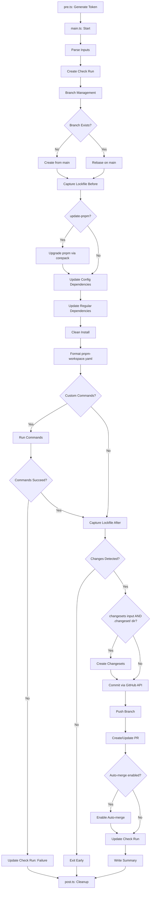

# pnpm Config Dependency Action

## Table of Contents

- [Dependencies](#dependencies)
- [Overview](#overview)
- [Purpose and Goals](#purpose-and-goals)
- [Architecture](#architecture)
  - [Module Structure](#module-structure)
  - [Data Flow](#data-flow)
  - [Phase Execution Model](#phase-execution-model)
- [Type Definitions](#type-definitions)
  - [Core Interfaces](#core-interfaces)
  - [Effect Error Types](#effect-error-types)
- [Module Breakdown](#module-breakdown)
  - [src/pre.ts - Token Generation](#srcprets---token-generation)
  - [src/main.ts - Orchestration](#srcmaints---orchestration)
  - [src/post.ts - Cleanup](#srcpostts---cleanup)
  - [src/lib/ - Utility Modules](#srclib---utility-modules)
- [Effect Patterns](#effect-patterns)
  - [Error Handling Strategy](#error-handling-strategy)
  - [Typed Errors with Data.TaggedError](#typed-errors-with-datataggederror)
  - [Error Accumulation with Effect.partition](#error-accumulation-with-effectpartition)
  - [Retry Policies with Schedule](#retry-policies-with-schedule)
  - [Resource Management with acquireUseRelease](#resource-management-with-acquireuserelease)
- [GitHub Integration](#github-integration)
  - [GitHub App Authentication](#github-app-authentication)
  - [Branch Management](#branch-management)
  - [Check Runs and Status](#check-runs-and-status)
  - [Pull Request Management](#pull-request-management)
- [Testing Strategy](#testing-strategy)
  - [Unit Testing](#unit-testing)
  - [Integration Testing](#integration-testing)
  - [Test Fixtures](#test-fixtures)
- [Implementation Plan](#implementation-plan)
  - [Phase 1: Core Infrastructure](#phase-1-core-infrastructure)
  - [Phase 2: Dependency Updates](#phase-2-dependency-updates)
  - [Phase 3: Changeset Integration](#phase-3-changeset-integration)
  - [Phase 4: GitHub Integration](#phase-4-github-integration)

## Dependencies

**Runtime Dependencies (bundled into action):**

```json
{
 "dependencies": {
  "@actions/core": "^3.0.0",
  "@actions/exec": "^3.0.0",
  "@actions/github": "^9.0.0",
  "@actions/glob": "^0.6.1",
  "@actions/http-client": "^4.0.0",
  "@actions/io": "^3.0.2",
  "@octokit/auth-app": "^8.1.2",
  "@octokit/rest": "^22.0.1",
  "@pnpm/catalogs.config": "^1.0.0",
  "@pnpm/catalogs.protocol-parser": "^1.0.0",
  "@pnpm/lockfile.fs": "^10.0.0",
  "@pnpm/lockfile.types": "^8.0.0",
  "@pnpm/workspace.read-manifest": "^6.0.0",
  "effect": "^3.0.0",
  "workspace-tools": "^0.40.0",
  "yaml": "^2.6.0",
  "semver": "^7.7.4"
 }
}
```

**Key Packages:**

- `@actions/core` - Logging, inputs, outputs, **state persistence between phases**
- `@actions/exec` - Execute shell commands (pnpm, git)
- `@actions/github` - GitHub context and Octokit client
- `@octokit/auth-app` - GitHub App JWT and installation token generation
- `effect` - Typed error handling, retry logic, resource management
- `yaml` - Parse and stringify `pnpm-workspace.yaml` with consistent formatting
- `semver` - Semantic version parsing, comparison, and range resolution for pnpm self-upgrade

**pnpm Official Packages (for lockfile/workspace analysis):**

- `@pnpm/lockfile.fs` - Read/write `pnpm-lock.yaml`
  - `readWantedLockfile(pkgPath, opts)` - Read lockfile, get `LockfileObject`
  - Returns catalogs, packages, importers for diff comparison
- `@pnpm/lockfile.types` - TypeScript types for lockfile structures
  - `LockfileObject`, `CatalogSnapshots`, `ProjectSnapshot`
- `@pnpm/catalogs.config` - Extract catalogs from workspace manifest
  - `getCatalogsFromWorkspaceManifest(manifest)`
- `@pnpm/catalogs.protocol-parser` - Parse `catalog:` protocol references
  - `parseCatalogProtocol(version)` - Returns catalog name or null
- `@pnpm/workspace.read-manifest` - Read `pnpm-workspace.yaml`
  - `readWorkspaceManifest(workspaceRoot)`

**workspace-tools (Microsoft):**

- `getWorkspaceManagerAndRoot(cwd)` - Detect pnpm/yarn/npm and workspace root
- `getWorkspaceInfos(cwd)` / `getWorkspaceInfosAsync(cwd)` - Get all package info
- `getWorkspacePackagePaths(cwd)` - Get paths to all workspace packages
- `getCatalogs(root, manager)` - Get catalogs for pnpm/yarn

## Overview

The `pnpm-config-dependency-action` is a GitHub Action that automates updates to pnpm config dependencies
and regular dependencies. Unlike Dependabot, this action supports
[pnpm's config dependencies](https://pnpm.io/config-dependencies) feature, which allows dependencies to be
declared in `pnpm-workspace.yaml` for centralized version management across a monorepo.

**Key Features:**

- Upgrades pnpm itself to the latest version within the `^` semver range via `corepack use`
- Updates config dependencies via `pnpm add --config`
- Updates regular dependencies via direct npm registry queries (avoids `catalogMode: strict` issues)
- Supports glob patterns for dependency matching
- Runs custom commands after updates (linting, testing, building)
- Integrates with Changesets for versioning
- Uses GitHub App authentication for secure, short-lived tokens
- Manages dedicated update branch with automatic rebasing
- Creates verified/signed commits via GitHub API
- Creates detailed PR summaries with dependency changes

## Purpose and Goals

**Primary Goals:**

1. **Config Dependency Support**: Fill the gap left by Dependabot's lack of config dependency support
2. **Monorepo Centralization**: Enable centralized dependency management in pnpm monorepos
3. **Automation**: Reduce manual effort in keeping dependencies up-to-date
4. **Safety**: Provide clear visibility into what's being updated via detailed PR summaries
5. **Integration**: Work seamlessly with existing tools (Changesets, CI/CD, code review)
6. **Flexibility**: Support custom commands after updates (linting, testing, building)

**Non-Goals:**

- Replace Dependabot entirely (complementary tool)
- Support other package managers (pnpm-specific)
- Automatically merge PRs (requires human review)
- Handle breaking change detection (relies on semver and testing)

## Architecture

### Module Structure

```text
src/
├── main.ts              # Main orchestration logic
├── pre.ts               # GitHub App token generation (runs first)
├── post.ts              # Cleanup and token revocation (runs last)
├── lib/
│   ├── inputs.ts        # Action input parsing and validation
│   ├── github/
│   │   ├── auth.ts      # GitHub App authentication
│   │   ├── branch.ts    # Branch management (create, rebase, switch)
│   │   ├── check.ts     # Check run creation and updates
│   │   ├── pr.ts        # Pull request creation and updates
│   │   └── commit.ts    # Commit creation with DCO signoff
│   ├── pnpm/
│   │   ├── config.ts    # Config dependency updates
│   │   ├── regular.ts   # Regular dependency updates (npm query + package.json)
│   │   ├── install.ts   # pnpm install execution
│   │   ├── format.ts    # pnpm-workspace.yaml formatting
│   │   └── upgrade.ts   # pnpm self-upgrade via corepack
│   ├── changeset/
│   │   ├── detect.ts    # Detect if repo uses changesets
│   │   ├── analyze.ts   # Analyze which packages changed
│   │   └── create.ts    # Create changeset files
│   ├── git/
│   │   ├── status.ts    # Git status checking
│   │   └── diff.ts      # Git diff analysis
│   ├── errors/
│   │   └── types.ts     # Typed error definitions
│   └── utils/
│       ├── logging.ts   # Structured logging
│       └── summary.ts   # GitHub Actions summary writing
└── types/
    └── index.ts         # Shared type definitions
```

### Data Flow



### Phase Execution Model

The action executes in **14 distinct steps** (implemented in `src/main.ts`):

#### Step 1: Setup

- Parse and validate inputs (including optional `run` commands, `update-pnpm` flag, and `changesets` flag)
- Retrieve GitHub App token from state (generated by `pre.ts`)
- Create check run for status visibility

#### Step 2: Branch Management

- Check if update branch exists
- Create new branch from main OR rebase existing branch onto main
- Switch to update branch

#### Step 3: Capture Lockfile State (Before)

- Read current `pnpm-lock.yaml` using `@pnpm/lockfile.fs`
- Store snapshot for later comparison
- Log package and importer counts

#### Step 4: Upgrade pnpm (conditional)

- Conditional on `inputs.updatePnpm` (default: `true`)
- Read root `package.json` to extract `packageManager` and `devEngines.packageManager` fields
- Parse pnpm version strings (handles `pnpm@10.28.2`, `pnpm@^10.28.2+sha512...`, `^10.28.2`)
- Query available pnpm versions via `npm view pnpm versions --json`
- Filter to stable releases only (no pre-release)
- Resolve latest version within `^` semver range using `semver.maxSatisfying`
- Take the highest resolved version across both fields
- If already up-to-date, skip (return null)
- Run `corepack use pnpm@<version>` to update the `packageManager` field
- Re-read `package.json`, detect indentation, update `devEngines.packageManager.version`
- Report result as a config dependency update (`dependency: "pnpm"`, `type: "config"`)

#### Step 5: Update Config Dependencies

- Update config dependencies one by one via `pnpm add --config`
- Track version changes (from/to)
- Accumulate errors without failing entirely

#### Step 6: Update Regular Dependencies

- Query npm registry directly for latest versions (avoids `pnpm up --latest` which
  promotes deps to catalogs when `catalogMode: strict` is enabled)
- Find all workspace `package.json` files via `workspace-tools` `getPackageInfosAsync()`
- Match dependency names against glob patterns like `effect`, `@effect/*`, `@savvy-web/*`
- Skip `catalog:` and `workspace:` specifiers (leave catalog-managed deps untouched)
- Query `npm view <pkg> dist-tags.latest --json` for each unique matching dependency
- Compare current version with latest; if newer, construct new specifier preserving
  prefix (`^`, `~`, or exact) and update `package.json` files directly
- Preserve `package.json` indentation (tabs/spaces) via `detectIndent`
- Returns `DependencyUpdateResult[]` directly (no lockfile inference needed)

#### Step 7: Clean Install

- Triggered when config updates, regular dependency updates, or pnpm upgrade produced changes
- Remove `node_modules` and `pnpm-lock.yaml` for a fresh lockfile
- Execute `pnpm install` to regenerate lockfile from scratch
- Ensures a fully coherent lockfile after all dependency updates

#### Step 8: Format pnpm-workspace.yaml

- Format workspace YAML to match `@savvy-web/lint-staged` PnpmWorkspace handler
- Sort arrays alphabetically (packages, onlyBuiltDependencies, publicHoistPattern)
- Sort `configDependencies` object keys alphabetically
- Sort top-level keys alphabetically (packages first)
- Use consistent YAML stringify options (indent: 2, lineWidth: 0, singleQuote: false)

#### Step 9: Run Custom Commands (if specified)

- Execute commands from `run` input sequentially
- All commands run even if some fail (errors collected)
- If ANY command fails, update check run with failure and exit early
- No PR created if commands fail
- Examples: `pnpm lint:fix`, `pnpm test`, `pnpm build`

#### Step 10: Capture Lockfile State (After)

- Read updated `pnpm-lock.yaml`
- Store snapshot for comparison

#### Step 11: Detect Changes

- Compare lockfile snapshots (before vs after) for catalog and specifier changes
- Regular dependency updates come directly from step 6 (not inferred from lockfile diff)
- Combine pnpm upgrade result, config updates, and regular updates into `allUpdates`
- Check git status for modified files
- Exit early if no changes detected

#### Step 12: Create Changesets (conditional)

- **Skipped entirely** if the `changesets` input is `false` (default: `true`)
- When enabled, detect if `.changeset/` directory exists (skip if not present)
- Group changes by affected package
- Create patch changeset for each affected package
- Create empty changeset for root workspace if only config deps changed
- Config dependencies passed to changeset creation

#### Step 13: Commit and Push

- **Commit via GitHub API** (not `git commit`)
- Create tree with modified files
- Create commit with sign-off (NO author specified for verification)
- Update branch ref to new commit SHA
- Push to update branch (force-push if rebased)

#### Step 14: Create/Update PR

- Check if PR already exists for branch
- Create new PR or update existing PR body
- Generate detailed summary with dependency tables (pnpm upgrade appears in Config Dependencies table)
- If `inputs.autoMerge` is set to a merge method ("merge", "squash", or "rebase"), enable auto-merge via GitHub GraphQL API
  - Uses `enablePullRequestAutoMerge` mutation with the PR's node ID
  - Requires repository "Allow auto-merge" setting enabled
  - Requires branch protection with required status checks on target branch
  - If enabling auto-merge fails, log warning but do not fail the action
- Update check run with success/failure
- Write GitHub Actions summary

## Type Definitions

### Core Interfaces

```typescript
import type { Effect } from "effect";
import type { Octokit } from "@octokit/rest";

/**
 * Parsed action inputs from action.yml (9 fields, defined via Effect Schema).
 */
export interface ActionInputs {
 readonly appId: string;           // NonEmptyString
 readonly appPrivateKey: string;   // NonEmptyString
 readonly branch: string;          // Pattern validated: /^[a-zA-Z0-9/_-]+$/
 readonly configDependencies: ReadonlyArray<string>;
 readonly dependencies: ReadonlyArray<string>;
 readonly run: ReadonlyArray<string>;
 readonly updatePnpm: boolean;     // default: true
 readonly autoMerge: "" | "merge" | "squash" | "rebase"; // default: ""
 readonly changesets: boolean;     // default: true, controls whether changesets are created for dependency updates
}

/**
 * GitHub context for the action
 */
export interface GitHubContext {
 readonly owner: string;
 readonly repo: string;
 readonly ref: string;
 readonly sha: string;
 readonly defaultBranch: string; // usually "main"
}

/**
 * GitHub App installation token
 */
export interface InstallationToken {
 readonly token: string;
 readonly expiresAt: Date;
 readonly permissions: Record<string, string>;
 readonly repositories?: ReadonlyArray<{ id: number; name: string }>;
}

/**
 * Authenticated Octokit client
 */
export interface AuthenticatedClient {
 readonly octokit: Octokit;
 readonly installationId: number;
}

/**
 * Branch management result
 */
export interface BranchResult {
 readonly branch: string;
 readonly created: boolean; // true if newly created, false if rebased
 readonly upToDate: boolean; // true if no rebase was needed
 readonly baseRef: string; // ref branch was created from or rebased onto
}

/**
 * Dependency update result
 */
export interface DependencyUpdateResult {
 readonly dependency: string;
 readonly from: string | null; // null if newly added
 readonly to: string;
 readonly type: "config" | "regular";
 readonly package: string | null; // null for config dependencies
}

/**
 * Changed package information
 */
export interface ChangedPackage {
 readonly name: string;
 readonly path: string;
 readonly version: string;
 readonly dependencies: ReadonlyArray<DependencyUpdateResult>;
}

/**
 * Changeset file to create
 */
export interface ChangesetFile {
 readonly packages: ReadonlyArray<string>; // package names
 readonly type: "patch"; // always patch for dependency updates
 readonly summary: string;
}

/**
 * Check run information
 */
export interface CheckRun {
 readonly id: number;
 readonly name: string;
 readonly status: "queued" | "in_progress" | "completed";
 readonly conclusion?: "success" | "failure" | "neutral" | "cancelled" | "skipped";
}

/**
 * Pull request information
 */
export interface PullRequest {
 readonly number: number;
 readonly url: string;
 readonly created: boolean; // true if newly created, false if updated
 readonly nodeId: string;
}

/**
 * Complete action result
 */
export interface ActionResult {
 readonly updates: ReadonlyArray<DependencyUpdateResult>;
 readonly changedPackages: ReadonlyArray<ChangedPackage>;
 readonly changesets: ReadonlyArray<ChangesetFile>;
 readonly branch: BranchResult;
 readonly pr: PullRequest;
 readonly checkRun: CheckRun;
}

/**
 * Result of a pnpm upgrade operation (from src/lib/pnpm/upgrade.ts).
 */
export interface PnpmUpgradeResult {
 readonly from: string;
 readonly to: string;
 readonly packageManagerUpdated: boolean;
 readonly devEnginesUpdated: boolean;
}

/**
 * Parsed pnpm version info (from src/lib/pnpm/upgrade.ts).
 */
export interface ParsedPnpmVersion {
 readonly version: string;
 readonly hasCaret: boolean;
 readonly hasSha: boolean;
}
```

### Effect Error Types

Using Effect's `Data.TaggedError` for typed error handling:

```typescript
import { Data } from "effect";

/**
 * Input validation errors
 */
export class InvalidInputError extends Data.TaggedError("InvalidInputError")<{
 readonly field: string;
 readonly value: unknown;
 readonly reason: string;
}> {}

/**
 * GitHub authentication errors
 */
export class AuthenticationError extends Data.TaggedError("AuthenticationError")<{
 readonly reason: string;
 readonly appId?: string;
}> {}

/**
 * GitHub API errors
 */
export class GitHubApiError extends Data.TaggedError("GitHubApiError")<{
 readonly operation: string;
 readonly statusCode: number;
 readonly message: string;
}> {}

/**
 * Git operation errors
 */
export class GitError extends Data.TaggedError("GitError")<{
 readonly operation: "status" | "diff" | "commit" | "push" | "rebase" | "checkout";
 readonly exitCode: number;
 readonly stderr: string;
}> {}

/**
 * pnpm command errors
 */
export class PnpmError extends Data.TaggedError("PnpmError")<{
 readonly command: string;
 readonly dependency?: string;
 readonly exitCode: number;
 readonly stderr: string;
}> {}

/**
 * Changeset creation errors
 */
export class ChangesetError extends Data.TaggedError("ChangesetError")<{
 readonly reason: string;
 readonly packages?: ReadonlyArray<string>;
}> {}

/**
 * File system errors
 */
export class FileSystemError extends Data.TaggedError("FileSystemError")<{
 readonly operation: "read" | "write" | "delete" | "exists";
 readonly path: string;
 readonly reason: string;
}> {}

/**
 * Aggregate error for collecting multiple failures
 */
export class DependencyUpdateFailures extends Data.TaggedError("DependencyUpdateFailures")<{
 readonly failures: ReadonlyArray<{
  readonly dependency: string;
  readonly error: PnpmError;
 }>;
 readonly successful: ReadonlyArray<DependencyUpdateResult>;
}> {}
```

## Module Breakdown

### src/pre.ts - Token Generation

**Responsibility:** Generate GitHub App installation token before main action runs.

**State Persistence:**

The pre.ts phase uses `@actions/core` `saveState()` to persist values for main.ts and post.ts:

```typescript
import { getInput, saveState, setSecret, setOutput, info } from "@actions/core";

// Values saved in pre.ts are available via getState() in main.ts and post.ts
saveState("token", token);                    // GitHub App installation token
saveState("expiresAt", expiresAt);            // Token expiration timestamp
saveState("installationId", installationId); // For token revocation in post.ts
saveState("appSlug", appSlug);               // For logging
saveState("startTime", Date.now().toString()); // For timing
```

**Effect Signature:**

```typescript
export const generateToken: Effect.Effect<
 InstallationToken,
 AuthenticationError | GitHubApiError
> = Effect.gen(function* () {
 // 1. Parse app ID and private key from inputs
 const appId = yield* parseAppId();
 const privateKey = yield* parsePrivateKey();

 // 2. Create JWT for GitHub App authentication
 const jwt = yield* createJWT(appId, privateKey);

 // 3. Get installation ID for this repository
 const installationId = yield* getInstallationId(jwt);

 // 4. Generate installation token
 const token = yield* createInstallationToken(jwt, installationId);

 // 5. Save state for main.ts and post.ts
 yield* Effect.sync(() => {
  saveState("token", token.token);
  saveState("expiresAt", token.expiresAt.toISOString());
  saveState("installationId", installationId.toString());
  setSecret(token.token); // Mask in logs
  setOutput("token", token.token);
 });

 return token;
});
```

**Key Functions:**

- `parseAppId()`: Extract and validate app-id input
- `parsePrivateKey()`: Extract and validate app-private-key input
- `createJWT()`: Generate JWT using @octokit/auth-app
- `getInstallationId()`: Fetch installation ID for the repository
- `createInstallationToken()`: Generate short-lived token with required permissions
- `setActionOutput()`: Set token as action output for subsequent steps
- `setEnvVar()`: Set GITHUB_TOKEN environment variable

**Required Permissions:**

- `contents: write` - Push commits and branches
- `pull-requests: write` - Create and update PRs
- `checks: write` - Create and update check runs

### src/main.ts - Orchestration

**Responsibility:** Coordinate all phases of the dependency update workflow.

**State Retrieval:**

Main.ts retrieves state saved by pre.ts using `@actions/core` `getState()`:

```typescript
import { getState, info } from "@actions/core";

// Retrieve values saved by pre.ts
const token = getState("token");
const expiresAt = getState("expiresAt");
const appSlug = getState("appSlug");

if (!token) {
 throw new Error("No token available. Pre-action should have generated a token.");
}

info(`Using token for app "${appSlug}" (expires: ${expiresAt})`);
```

**Effect Signature:**

```typescript
export const main: Effect.Effect<ActionResult, never> = Effect.gen(function* () {
 // Phase 1: Setup - retrieve token from pre.ts state
 const token = yield* Effect.sync(() => getState("token")).pipe(
  Effect.filterOrFail(
   (t) => t.length > 0,
   () => new AuthenticationError({ reason: "No token in state. Ensure pre.ts ran." })
  )
 );

 const inputs = yield* parseInputs().pipe(
  Effect.catchAll((error) =>
   Effect.gen(function* () {
    yield* logError("Input validation failed", error);
    yield* setFailed(error.reason);
    return yield* Effect.fail(error);
   })
  )
 );

 const context = yield* getGitHubContext();
 const client = yield* createAuthenticatedClient();
 const checkRun = yield* createCheckRun(client, context, "pnpm config dependencies");

 // Phase 2: Branch Management
 const branchResult = yield* manageBranch(client, context, inputs.branch).pipe(
  Effect.tap((result) =>
   logInfo(
    result.created
     ? `Created branch ${result.branch} from ${result.baseRef}`
     : `Rebased ${result.branch} onto ${result.baseRef}`
   )
  )
 );

 // Phase 3: Dependency Updates (with error accumulation)
 const configUpdates = yield* updateConfigDependencies(inputs.configDependencies).pipe(
  Effect.catchAll((error) => accumulateErrors(error, []))
 );

 yield* runPnpmInstall();

 const regularUpdates = yield* updateRegularDependencies(inputs.dependencies).pipe(
  Effect.catchAll((error) => accumulateErrors(error, configUpdates))
 );

 const allUpdates = [...configUpdates, ...regularUpdates];

 // Phase 4: Change Detection
 const hasChanges = yield* detectChanges();
 if (!hasChanges) {
  yield* updateCheckRun(checkRun.id, "completed", "neutral", "No dependency updates available");
  yield* writeSummary("No changes detected. All dependencies are up-to-date.");
  return yield* Effect.succeed({ updates: [], changedPackages: [], changesets: [], branch: branchResult });
 }

 const changedPackages = yield* analyzeChangedPackages(allUpdates);

 // Phase 5: Changeset Creation (conditional on `changesets` input AND .changeset/ directory)
 const changesets = yield* Effect.if(
  () => inputs.changesets && changesetDirectoryExists(),
  {
   onTrue: () => createChangesets(changedPackages),
   onFalse: () => Effect.succeed([])
  }
 );

 // Phase 6: Commit and Push
 yield* formatWorkspaceYaml();
 yield* commitChanges(allUpdates, changesets);
 yield* pushBranch(branchResult.branch, branchResult.created === false);

 // Phase 7: Pull Request
 const pr = yield* createOrUpdatePR(client, context, branchResult.branch, allUpdates, changedPackages);

 // Phase 7.5: Enable Auto-merge (if configured)
 if (inputs.autoMerge !== "") {
  yield* enableAutoMerge(client, pr.nodeId, inputs.autoMerge).pipe(
   Effect.catchAll((error) =>
    Effect.gen(function* () {
     yield* logWarning(`Failed to enable auto-merge: ${error.message}`);
     return Effect.succeed(void 0);
    })
   )
  );
 }

 // Phase 8: Finalization
 yield* updateCheckRun(checkRun.id, "completed", "success", `Updated ${allUpdates.length} dependencies`);
 yield* writeSummary(generateSummaryMarkdown(allUpdates, changedPackages, pr));

 return { updates: allUpdates, changedPackages, changesets, branch: branchResult, pr, checkRun };
}).pipe(
 Effect.catchAll((error) =>
  Effect.gen(function* () {
   yield* logError("Action failed", error);
   yield* setFailed(formatErrorMessage(error));
   return yield* Effect.fail(error);
  })
 )
);
```

**Key Responsibilities:**

- Coordinate phase execution in correct order
- Handle errors gracefully with accumulation where appropriate
- Provide detailed logging at each step
- Exit early if no changes detected
- Generate comprehensive summaries

### src/post.ts - Cleanup

**Responsibility:** Clean up resources and revoke tokens after action completes.

**State Retrieval:**

Post.ts retrieves state from pre.ts for cleanup operations:

```typescript
import { getState, info, warning } from "@actions/core";

// Retrieve values needed for cleanup
const token = getState("token");
const installationId = getState("installationId");
const startTime = getState("startTime");

const duration = Date.now() - parseInt(startTime, 10);
info(`Action completed in ${duration}ms`);
```

**Effect Signature:**

```typescript
export const cleanup: Effect.Effect<void, never> = Effect.gen(function* () {
 // Retrieve state saved by pre.ts
 const token = yield* Effect.sync(() => getState("token"));
 const installationId = yield* Effect.sync(() => getState("installationId"));
 const skipRevoke = yield* Effect.sync(() => getState("skipTokenRevoke") === "true");

 // 1. Revoke GitHub App token (unless skipped or no token)
 if (token && installationId && !skipRevoke) {
  yield* revokeToken(token, parseInt(installationId, 10)).pipe(
   Effect.catchAll((error) => {
    // Log but don't fail cleanup
    yield* Effect.sync(() => warning(`Failed to revoke token: ${error}`));
    return Effect.succeed(void 0);
   })
  );
 }

 // 2. Log completion time
 const startTime = yield* Effect.sync(() => getState("startTime"));
 if (startTime) {
  const duration = Date.now() - parseInt(startTime, 10);
  yield* Effect.sync(() => info(`Action completed in ${duration}ms`));
 }

 // 3. Clean up temporary files (if any)
 yield* cleanupTempFiles().pipe(Effect.catchAll(() => Effect.succeed(void 0)));
});
```

**Key Functions:**

- `revokeToken()`: Revoke the GitHub App installation token
- `clearEnvVar()`: Remove GITHUB_TOKEN from environment
- `cleanupTempFiles()`: Remove any temporary files created during execution

### src/lib/ - Utility Modules

#### src/lib/inputs.ts

Parse and validate action inputs from `action.yml`.

Uses Effect Schema (`src/lib/schemas/index.ts`) for type-safe validation and decoding.
The `ActionInputs` schema has 9 fields including the `updatePnpm: Schema.Boolean` field,
the `autoMerge` field (values: `""`, `"merge"`, `"squash"`, or `"rebase"`), and the
`changesets: Schema.Boolean` field (default: `true`).

**Validation Logic:**

The action requires at least one update type to be active. The validation allows the action
to run with only `updatePnpm: true` even if both `configDependencies` and `dependencies`
arrays are empty. This means any of the following are valid configurations:

- `configDependencies` is non-empty
- `dependencies` is non-empty
- `updatePnpm` is `true` (default)
- Any combination of the above

```typescript
export const parseInputs: Effect.Effect<ActionInputs, InvalidInputError> = Effect.gen(function* () {
 const appId = yield* getRequiredInput("app-id");
 const appPrivateKey = yield* getRequiredInput("app-private-key");
 const branch = yield* getInput("branch").pipe(Effect.map((b) => b || "pnpm/config"));
 const updatePnpm = yield* getBooleanInput("update-pnpm"); // default: true

 const configDeps = yield* getMultilineInput("config-dependencies").pipe(
  Effect.map((lines) => lines.filter((line) => line.trim().length > 0))
 );

 const deps = yield* getMultilineInput("dependencies").pipe(
  Effect.map((lines) => lines.filter((line) => line.trim().length > 0))
 );

 // Validate at least one update type is specified
 // updatePnpm: true alone is sufficient
 if (configDeps.length === 0 && deps.length === 0 && !updatePnpm) {
  return yield* Effect.fail(
   new InvalidInputError({
    field: "inputs",
    value: { configDeps, deps, updatePnpm },
    reason: "Must specify at least one of: config-dependencies, dependencies, or update-pnpm"
   })
  );
 }

 const autoMerge = yield* getInput("auto-merge").pipe(
  Effect.map((val) => {
   const normalized = val.trim().toLowerCase();
   if (normalized === "" || normalized === "merge" || normalized === "squash" || normalized === "rebase") {
    return normalized as "" | "merge" | "squash" | "rebase";
   }
   return ""; // default to disabled for invalid values
  })
 );

 const changesets = yield* getBooleanInput("changesets"); // default: true

 return {
  appId, appPrivateKey, branch, updatePnpm, autoMerge, changesets,
  configDependencies: configDeps, dependencies: deps, run: []
 };
});
```

#### src/lib/github/auth.ts

GitHub App authentication:

```typescript
export const createAuthenticatedClient: Effect.Effect<
 AuthenticatedClient,
 AuthenticationError | GitHubApiError
> = Effect.gen(function* () {
 // Token should be set by pre.ts
 const token = yield* getEnvVar("GITHUB_TOKEN").pipe(
  Effect.catchAll(() =>
   Effect.fail(
    new AuthenticationError({
     reason: "GITHUB_TOKEN not found. Ensure pre.ts ran successfully."
    })
   )
  )
 );

 const octokit = new Octokit({ auth: token });

 // Verify authentication by getting installation ID
 const installationId = yield* getInstallationId(octokit);

 return { octokit, installationId };
});
```

#### src/lib/github/branch.ts

Branch management with create/rebase logic:

```typescript
export const manageBranch = (
 client: AuthenticatedClient,
 context: GitHubContext,
 branchName: string
): Effect.Effect<BranchResult, GitHubApiError | GitError> =>
 Effect.gen(function* () {
  const exists = yield* branchExists(client, context, branchName);

  if (!exists) {
   // Create new branch from default branch
   yield* createBranch(client, context, branchName, context.defaultBranch);
   yield* gitCheckout(branchName);
   return {
    branch: branchName,
    created: true,
    upToDate: true,
    baseRef: context.defaultBranch
   };
  }

  // Branch exists - check if up-to-date with main
  const needsRebase = yield* branchNeedsRebase(context.defaultBranch, branchName);

  if (needsRebase) {
   // Rebase onto default branch
   yield* gitCheckout(branchName);
   yield* gitRebase(context.defaultBranch);
   return {
    branch: branchName,
    created: false,
    upToDate: false,
    baseRef: context.defaultBranch
   };
  }

  // Already up-to-date
  yield* gitCheckout(branchName);
  return {
   branch: branchName,
   created: false,
   upToDate: true,
   baseRef: context.defaultBranch
  };
 });
```

#### src/lib/pnpm/format.ts

**Purpose:** Format `pnpm-workspace.yaml` consistently to avoid lint-staged hook changes.

The formatting must match the `@savvy-web/lint-staged` PnpmWorkspace handler to ensure
no changes are made by the pre-commit hook after our action commits.

**Formatting Rules:**

1. **Sort arrays alphabetically:** `packages`, `onlyBuiltDependencies`, `publicHoistPattern`
2. **Sort `configDependencies` object keys alphabetically** (entries inserted by
   `pnpm add --config` may not be in order)
3. **Sort top-level keys alphabetically**, but keep `packages` first
4. **YAML stringify options:**
   - `indent: 2` - Two-space indentation
   - `lineWidth: 0` - Disable line wrapping
   - `singleQuote: false` - Use double quotes

**Implementation:**

```typescript
import { parse, stringify } from "yaml";
import { Effect } from "effect";

const SORTABLE_ARRAY_KEYS = new Set(["packages", "onlyBuiltDependencies", "publicHoistPattern"]);
const SORTABLE_MAP_KEYS = new Set(["configDependencies"]);

const STRINGIFY_OPTIONS = {
 indent: 2,
 lineWidth: 0, // Disable line wrapping
 singleQuote: false,
} as const;

interface PnpmWorkspaceContent {
 packages?: string[];
 onlyBuiltDependencies?: string[];
 publicHoistPattern?: string[];
 configDependencies?: Record<string, string>;
 [key: string]: unknown;
}

const sortContent = (content: PnpmWorkspaceContent): PnpmWorkspaceContent => {
 const result: PnpmWorkspaceContent = {};

 // Sort keys alphabetically, but keep 'packages' first
 const keys = Object.keys(content).sort((a, b) => {
  if (a === "packages") return -1;
  if (b === "packages") return 1;
  return a.localeCompare(b);
 });

 for (const key of keys) {
  const value = content[key];
  if (SORTABLE_ARRAY_KEYS.has(key) && Array.isArray(value)) {
   result[key] = [...value].sort();
  } else if (SORTABLE_MAP_KEYS.has(key) && value && typeof value === "object" && !Array.isArray(value)) {
   const sorted: Record<string, unknown> = {};
   for (const k of Object.keys(value as Record<string, unknown>).sort()) {
    sorted[k] = (value as Record<string, unknown>)[k];
   }
   result[key] = sorted;
  } else {
   result[key] = value;
  }
 }

 return result;
};

export const formatWorkspaceYaml: Effect.Effect<void, FileSystemError> =
 Effect.gen(function* () {
  const content = yield* readFile("pnpm-workspace.yaml");
  const parsed = parse(content) as PnpmWorkspaceContent;
  const sorted = sortContent(parsed);
  const formatted = stringify(sorted, STRINGIFY_OPTIONS);
  yield* writeFile("pnpm-workspace.yaml", formatted);
 });
```

#### src/lib/pnpm/upgrade.ts

**Purpose:** Upgrade pnpm itself to the latest version within the `^` semver range.

Uses `semver` for version parsing, comparison, and range resolution. Updates both the
`packageManager` field (via `corepack use`) and the `devEngines.packageManager.version`
field (via direct JSON manipulation with indentation detection).

**Exported Types:**

- `PnpmUpgradeResult` - Result with `from`, `to`, `packageManagerUpdated`, `devEnginesUpdated`
- `ParsedPnpmVersion` - Parsed version with `version`, `hasCaret`, `hasSha` flags

**Exported Functions:**

- `parsePnpmVersion(raw, stripPnpmPrefix?)` - Parse version from `packageManager` or `devEngines` field
- `formatPnpmVersion(version, hasCaret)` - Format version with optional caret prefix
- `resolveLatestInRange(versions, current)` - Find highest stable version satisfying `^current`
- `upgradePnpm(workspaceRoot?)` - Main upgrade Effect requiring `PnpmExecutor` service

**Algorithm:**

1. Read root `package.json`
2. Parse `packageManager` field (format: `pnpm@10.28.2`, `pnpm@^10.28.2+sha512...`)
3. Parse `devEngines.packageManager` field (name must be `pnpm`, version field parsed)
4. If neither field found, return null
5. Query available pnpm versions via `npm view pnpm versions --json` (uses `PnpmExecutor.run()`)
6. Filter to stable releases only (no pre-release via `semver.prerelease`)
7. Resolve latest version in `^` range via `semver.maxSatisfying`
8. Take highest resolved version across both fields
9. If already up-to-date, return null
10. Run `corepack use pnpm@<version>` to update `packageManager` field
11. Re-read `package.json`, detect indentation (`detectIndent` internal helper), update `devEngines.packageManager.version`
12. Return `PnpmUpgradeResult`

**Effect Signature:**

```typescript
export const upgradePnpm = (
 workspaceRoot?: string
): Effect.Effect<PnpmUpgradeResult | null, FileSystemError, PnpmExecutor>
```

**Version Format Handling:**

| Input | `stripPnpmPrefix` | Parsed |
| --- | --- | --- |
| `pnpm@10.28.2` | `true` | `{ version: "10.28.2", hasCaret: false, hasSha: false }` |
| `pnpm@^10.28.2+sha512...` | `true` | `{ version: "10.28.2", hasCaret: true, hasSha: true }` |
| `^10.28.2` | `false` | `{ version: "10.28.2", hasCaret: true, hasSha: false }` |
| `yarn@4.0.0` | `true` | `null` (not pnpm) |

#### src/lib/pnpm/config.ts

Config dependency updates:

```typescript
export const updateConfigDependencies = (
 dependencies: ReadonlyArray<string>
): Effect.Effect<ReadonlyArray<DependencyUpdateResult>, DependencyUpdateFailures> =>
 Effect.gen(function* () {
  const results: Array<DependencyUpdateResult> = [];
  const failures: Array<{ dependency: string; error: PnpmError }> = [];

  // Update each config dependency sequentially (not parallel)
  for (const dep of dependencies) {
   const result = yield* updateConfigDependency(dep).pipe(
    Effect.catchAll((error) =>
     Effect.gen(function* () {
      failures.push({ dependency: dep, error });
      return yield* Effect.succeed(null);
     })
    )
   );

   if (result !== null) {
    results.push(result);
   }
  }

  // If all failed, return error
  if (failures.length > 0 && results.length === 0) {
   return yield* Effect.fail(new DependencyUpdateFailures({ failures, successful: [] }));
  }

  // If some failed, log warnings but continue
  if (failures.length > 0) {
   yield* logWarning(
    `Failed to update ${failures.length} config dependencies`,
    failures.map((f) => f.dependency)
   );
  }

  return results;
 });

const updateConfigDependency = (dependency: string): Effect.Effect<DependencyUpdateResult, PnpmError> =>
 Effect.gen(function* () {
  const before = yield* getConfigDependencyVersion(dependency).pipe(
   Effect.catchAll(() => Effect.succeed(null))
  );

  yield* execPnpm(["add", "--config", dependency]);

  const after = yield* getConfigDependencyVersion(dependency);

  return {
   dependency,
   from: before,
   to: after,
   type: "config" as const,
   package: null
  };
 });
```

#### src/lib/pnpm/regular.ts

**Purpose:** Update regular (non-config) dependencies by querying npm directly instead of
using `pnpm up --latest`. This avoids the `catalogMode: strict` issue where `pnpm up`
promotes non-catalog dependencies to the default catalog and rewrites specifiers to
`catalog:` references.

**Exported Functions:**

- `matchesPattern(depName, pattern)` - Glob matching via Node's native `path.matchesGlob`
- `parseSpecifier(specifier)` - Parse version specifier into `{ prefix, version }`,
  returns `null` for `catalog:` and `workspace:` specifiers
- `updateRegularDeps(patterns, workspaceRoot?)` - Main Effect function

**Algorithm:**

1. Find all workspace `package.json` paths via `workspace-tools` `getPackageInfosAsync()`
   plus the root `package.json`
2. For each `package.json`, scan `dependencies`, `devDependencies`, `optionalDependencies`
   for deps matching any pattern
3. Skip deps with `catalog:` or `workspace:` specifiers
4. Deduplicate entries per path+dep (a dep may appear in both `dependencies` and
   `devDependencies` of the same file)
5. Collect unique dependency names across all files
6. For each unique dep, query `npm view <pkg> dist-tags.latest --json` via `PnpmExecutor.run()`
7. Compare latest vs current: if newer, construct new specifier (preserve prefix + latest)
8. Update each `package.json` with new specifiers (preserve indentation via `detectIndent`
   from `upgrade.ts`)
9. Return `DependencyUpdateResult[]` with from/to specifiers and affected packages

**Effect Signature:**

```typescript
export const updateRegularDeps = (
 patterns: ReadonlyArray<string>,
 workspaceRoot?: string,
): Effect.Effect<ReadonlyArray<DependencyUpdateResult>, never, PnpmExecutor>
```

**Key Design Decisions:**

- Queries npm registry directly instead of relying on `pnpm up` to avoid catalog promotion
- Preserves specifier prefix (`^`, `~`, or exact) from existing `package.json`
- Skips `catalog:` and `workspace:` specifiers entirely (leave catalog-managed deps to
  the config dependency update path)
- Gracefully handles npm query failures per-dependency (logs warning, continues with others)
- Reuses `detectIndent` from `upgrade.ts` for consistent `package.json` formatting

#### src/lib/lockfile/compare.ts

**Purpose:** Compare lockfile snapshots before and after updates to detect changes.

Uses pnpm's official packages instead of manual parsing:

```typescript
import { readWantedLockfile } from "@pnpm/lockfile.fs";
import type { LockfileObject, CatalogSnapshots } from "@pnpm/lockfile.types";
import { getWorkspaceInfosAsync } from "workspace-tools";
import { Effect } from "effect";

interface LockfileChange {
 readonly type: "config" | "regular";
 readonly dependency: string;
 readonly from: string | null;
 readonly to: string;
 readonly affectedPackages: ReadonlyArray<string>;
}

/**
 * Captures lockfile state for later comparison.
 */
export const captureLockfileState = (
 workspaceRoot: string
): Effect.Effect<LockfileObject | null, FileSystemError> =>
 Effect.tryPromise({
  try: () => readWantedLockfile(workspaceRoot, { ignoreIncompatible: true }),
  catch: (error) => new FileSystemError({
   operation: "read",
   path: "pnpm-lock.yaml",
   reason: String(error)
  })
 });

/**
 * Compares two lockfile states to detect dependency changes.
 */
export const compareLockfiles = (
 before: LockfileObject | null,
 after: LockfileObject | null,
 workspaceRoot: string
): Effect.Effect<ReadonlyArray<LockfileChange>, never> =>
 Effect.gen(function* () {
  if (!before || !after) {
   return [];
  }

  const changes: LockfileChange[] = [];

  // Compare catalog snapshots (config dependencies)
  const catalogChanges = yield* compareCatalogs(
   before.catalogs ?? {},
   after.catalogs ?? {}
  );
  changes.push(...catalogChanges);

  // Compare package snapshots (regular dependencies)
  const packageChanges = yield* comparePackages(
   before,
   after,
   workspaceRoot
  );
  changes.push(...packageChanges);

  return changes;
 });

/**
 * Compare catalog snapshots to detect config dependency changes.
 */
const compareCatalogs = (
 before: CatalogSnapshots,
 after: CatalogSnapshots
): Effect.Effect<ReadonlyArray<LockfileChange>, never> =>
 Effect.sync(() => {
  const changes: LockfileChange[] = [];

  // Check all catalogs in 'after' for changes/additions
  for (const [catalogName, afterEntries] of Object.entries(after)) {
   const beforeEntries = before[catalogName] ?? {};

   for (const [dep, afterEntry] of Object.entries(afterEntries)) {
    const beforeEntry = beforeEntries[dep];
    const afterVersion = afterEntry.specifier;
    const beforeVersion = beforeEntry?.specifier ?? null;

    if (beforeVersion !== afterVersion) {
     changes.push({
      type: "config",
      dependency: `${dep} (catalog:${catalogName})`,
      from: beforeVersion,
      to: afterVersion,
      affectedPackages: [] // Config deps affect all packages
     });
    }
   }
  }

  return changes;
 });

/**
 * Compare package importers to detect which packages have changed dependencies.
 */
const comparePackages = (
 before: LockfileObject,
 after: LockfileObject,
 workspaceRoot: string
): Effect.Effect<ReadonlyArray<LockfileChange>, never> =>
 Effect.gen(function* () {
  const changes: LockfileChange[] = [];

  // Get workspace package info to map importers to package names
  const workspaceInfos = yield* Effect.tryPromise({
   try: () => getWorkspaceInfosAsync(workspaceRoot),
   catch: () => ({}) // Fallback to empty if detection fails
  });

  // Compare importers (each workspace package)
  for (const [importerId, afterSnapshot] of Object.entries(after.importers ?? {})) {
   const beforeSnapshot = before.importers?.[importerId];
   if (!beforeSnapshot) continue;

   // Find package name from workspace info
   const packageName = findPackageName(importerId, workspaceInfos);

   // Compare dependencies, devDependencies, optionalDependencies
   for (const field of ["dependencies", "devDependencies", "optionalDependencies"] as const) {
    const beforeDeps = beforeSnapshot[field] ?? {};
    const afterDeps = afterSnapshot[field] ?? {};

    for (const [dep, afterVersion] of Object.entries(afterDeps)) {
     const beforeVersion = beforeDeps[dep];
     if (beforeVersion !== afterVersion) {
      changes.push({
       type: "regular",
       dependency: dep,
       from: beforeVersion ?? null,
       to: afterVersion,
       affectedPackages: packageName ? [packageName] : []
      });
     }
    }
   }
  }

  return changes;
 });
```

#### src/lib/changeset/analyze.ts

**Purpose:** Determine which workspace packages were affected by dependency changes.

```typescript
import { getWorkspaceInfosAsync, getWorkspacePackagePathsAsync } from "workspace-tools";
import { Effect } from "effect";

interface AffectedPackage {
 readonly name: string;
 readonly path: string;
 readonly version: string;
 readonly changes: ReadonlyArray<{
  dependency: string;
  from: string | null;
  to: string;
 }>;
}

/**
 * Analyzes which packages are affected by dependency changes.
 */
export const analyzeAffectedPackages = (
 workspaceRoot: string,
 changes: ReadonlyArray<LockfileChange>
): Effect.Effect<ReadonlyArray<AffectedPackage>, FileSystemError> =>
 Effect.gen(function* () {
  const workspaceInfos = yield* Effect.tryPromise({
   try: () => getWorkspaceInfosAsync(workspaceRoot),
   catch: (error) => new FileSystemError({
    operation: "read",
    path: "workspace",
    reason: `Failed to get workspace info: ${error}`
   })
  });

  // Group changes by affected package
  const packageChanges = new Map<string, AffectedPackage["changes"][number][]>();

  // Config dependency changes affect all packages
  const configChanges = changes.filter((c) => c.type === "config");
  const regularChanges = changes.filter((c) => c.type === "regular");

  // For each workspace package
  const affected: AffectedPackage[] = [];
  for (const [name, info] of Object.entries(workspaceInfos)) {
   const pkgChanges: AffectedPackage["changes"][number][] = [];

   // Add config changes (they affect everyone)
   for (const change of configChanges) {
    pkgChanges.push({
     dependency: change.dependency,
     from: change.from,
     to: change.to
    });
   }

   // Add regular changes specific to this package
   for (const change of regularChanges) {
    if (change.affectedPackages.includes(name)) {
     pkgChanges.push({
      dependency: change.dependency,
      from: change.from,
      to: change.to
     });
    }
   }

   if (pkgChanges.length > 0) {
    affected.push({
     name,
     path: info.packageJsonPath.replace("/package.json", ""),
     version: info.packageJson.version ?? "0.0.0",
     changes: pkgChanges
    });
   }
  }

  return affected;
 });
```

#### src/lib/changeset/create.ts

Changeset generation:

```typescript
export const createChangesets = (
 changedPackages: ReadonlyArray<ChangedPackage>
): Effect.Effect<ReadonlyArray<ChangesetFile>, ChangesetError> =>
 Effect.gen(function* () {
  const changesets: Array<ChangesetFile> = [];

  if (changedPackages.length === 0) {
   // Only root/config changed - create empty changeset
   const emptyChangeset = yield* createEmptyChangeset();
   changesets.push(emptyChangeset);
  } else {
   // Create changeset for each changed package
   for (const pkg of changedPackages) {
    const changeset = yield* createPackageChangeset(pkg);
    changesets.push(changeset);
   }
  }

  // Write changeset files to .changeset/
  yield* Effect.all(changesets.map((cs) => writeChangesetFile(cs)));

  return changesets;
 });

const createPackageChangeset = (pkg: ChangedPackage): Effect.Effect<ChangesetFile, ChangesetError> =>
 Effect.gen(function* () {
  const depList = pkg.dependencies
   .map((dep) => `  - ${dep.dependency}: ${dep.from || "new"} → ${dep.to}`)
   .join("\n");

  const summary = `Update dependencies in ${pkg.name}:\n\n${depList}`;

  return {
   packages: [pkg.name],
   type: "patch" as const,
   summary
  };
 });
```

## Effect Patterns

### Service Architecture

The action uses Effect's Service and Layer system for clean dependency injection:

```typescript
import { Context, Effect, Layer } from "effect";
import { Command } from "@effect/platform";
import { NodeContext } from "@effect/platform-node";

// ══════════════════════════════════════════════════════════════════════════════
// Service Definitions (Tags)
// ══════════════════════════════════════════════════════════════════════════════

/** GitHub API client service */
class GitHubClient extends Context.Tag("GitHubClient")<
 GitHubClient,
 {
  readonly createBranch: (name: string, sha: string) => Effect.Effect<void, GitHubApiError>;
  readonly createPR: (data: PRData) => Effect.Effect<PullRequest, GitHubApiError>;
  readonly createCheckRun: (name: string) => Effect.Effect<CheckRun, GitHubApiError>;
  readonly enableAutoMerge: (nodeId: string, method: "MERGE" | "SQUASH" | "REBASE") => Effect.Effect<void, GitHubApiError>;
 }
>() {}

/** pnpm command executor service */
class PnpmExecutor extends Context.Tag("PnpmExecutor")<
 PnpmExecutor,
 {
  readonly addConfig: (dep: string) => Effect.Effect<DependencyUpdateResult, PnpmError>;
  readonly update: (pattern: string) => Effect.Effect<DependencyUpdateResult, PnpmError>;
  readonly install: () => Effect.Effect<void, PnpmError>;
  readonly run: (command: string) => Effect.Effect<string, PnpmError>; // Generic shell command execution
 }
>() {}

/** Git command executor service */
class GitExecutor extends Context.Tag("GitExecutor")<
 GitExecutor,
 {
  readonly checkout: (branch: string) => Effect.Effect<void, GitError>;
  readonly commit: (message: string) => Effect.Effect<void, GitError>;
  readonly push: (branch: string, force?: boolean) => Effect.Effect<void, GitError>;
  readonly status: () => Effect.Effect<GitStatus, GitError>;
 }
>() {}

// ══════════════════════════════════════════════════════════════════════════════
// Layer Implementations
// ══════════════════════════════════════════════════════════════════════════════

/** Create PnpmExecutor using @effect/platform Command */
const PnpmExecutorLive = Layer.effect(
 PnpmExecutor,
 Effect.gen(function* () {
  return {
   addConfig: (dep) =>
    Effect.gen(function* () {
     const result = yield* Command.make("pnpm", "add", "--config", dep).pipe(
      Command.string,
      Effect.mapError((e) => new PnpmError({ command: "add --config", dependency: dep, ...e }))
     );
     return parseUpdateResult(result, dep, "config");
    }),

   update: (pattern) =>
    Effect.gen(function* () {
     const result = yield* Command.make("pnpm", "up", pattern, "--latest").pipe(
      Command.string,
      Effect.mapError((e) => new PnpmError({ command: "up --latest", dependency: pattern, ...e }))
     );
     return parseUpdateResult(result, pattern, "regular");
    }),

   install: () =>
    Command.make("pnpm", "install").pipe(
     Command.exitCode,
     Effect.filterOrFail(
      (code) => code === 0,
      () => new PnpmError({ command: "install", exitCode: 1, stderr: "Install failed" })
     ),
     Effect.asVoid
    )
  };
 })
);

/** Create GitHubClient from token */
const GitHubClientLive = (token: string) =>
 Layer.succeed(GitHubClient, {
  createBranch: (name, sha) =>
   Effect.tryPromise({
    try: () => octokit.rest.git.createRef({ ...context.repo, ref: `refs/heads/${name}`, sha }),
    catch: (e) => new GitHubApiError({ operation: "createRef", message: String(e) })
   }).pipe(Effect.asVoid),

  createPR: (data) =>
   Effect.tryPromise({
    try: () => octokit.rest.pulls.create({ ...context.repo, ...data }),
    catch: (e) => new GitHubApiError({ operation: "pulls.create", message: String(e) })
   }).pipe(Effect.map((r) => ({ number: r.data.number, url: r.data.html_url, created: true, nodeId: r.data.node_id }))),

  enableAutoMerge: (nodeId, method) =>
   Effect.tryPromise({
    try: () => octokit.graphql(`
     mutation($pullRequestId: ID!, $mergeMethod: PullRequestMergeMethod!) {
      enablePullRequestAutoMerge(input: { pullRequestId: $pullRequestId, mergeMethod: $mergeMethod }) {
       pullRequest { id }
      }
     }
    `, { pullRequestId: nodeId, mergeMethod: method }),
    catch: (e) => new GitHubApiError({ operation: "enablePullRequestAutoMerge", message: String(e) })
   }).pipe(Effect.asVoid),

  createCheckRun: (name) =>
   Effect.tryPromise({
    try: () => octokit.rest.checks.create({ ...context.repo, name, head_sha: context.sha, status: "in_progress" }),
    catch: (e) => new GitHubApiError({ operation: "checks.create", message: String(e) })
   }).pipe(Effect.map((r) => ({ id: r.data.id, name, status: "in_progress" as const })))
 });

// ══════════════════════════════════════════════════════════════════════════════
// Composed Application Layer
// ══════════════════════════════════════════════════════════════════════════════

const makeAppLayer = (token: string) =>
 Layer.mergeAll(
  GitHubClientLive(token),
  PnpmExecutorLive,
  GitExecutorLive
 ).pipe(Layer.provide(NodeContext.layer)); // Provides platform requirements
```

### Error Handling Strategy

Effect distinguishes between **expected errors** (typed, recoverable) and **unexpected errors** (defects):

**Expected Errors (Typed):**

- `PnpmError` - pnpm command failures
- `GitError` - git operation failures
- `GitHubApiError` - API call failures
- `InvalidInputError` - validation failures

**Unexpected Errors (Defects):**

- Runtime exceptions
- Network timeouts
- Out of memory

**Strategy by Error Type:**

| Scenario | Strategy | Effect Pattern |
| --- | --- | --- |
| Critical errors | Fail fast | `Effect.fail()` |
| Batch operations | Accumulate | `Effect.partition()` |
| Transient failures | Retry | `Effect.retry(Schedule)` |
| Optional features | Graceful degradation | `Effect.catchAll()` |

### Typed Errors with Data.TaggedError

```typescript
import { Data } from "effect";

/** pnpm command execution error */
export class PnpmError extends Data.TaggedError("PnpmError")<{
 readonly command: string;
 readonly dependency?: string;
 readonly exitCode?: number;
 readonly stderr?: string;
}> {}

// Pattern match on error type
const handleError = (error: PnpmError | GitError) =>
 Effect.gen(function* () {
  switch (error._tag) {
   case "PnpmError":
    yield* Effect.logError(`pnpm ${error.command} failed: ${error.stderr}`);
    break;
   case "GitError":
    yield* Effect.logError(`git ${error.operation} failed: ${error.stderr}`);
    break;
  }
 });
```

### Error Accumulation with Effect.partition

For batch operations, use `Effect.partition` to collect both successes and failures:

```typescript
import { Effect, Array } from "effect";

/**
 * Update multiple dependencies, collecting both successes and failures.
 * Continues processing even if some updates fail.
 */
export const updateDependenciesWithAccumulation = (
 dependencies: ReadonlyArray<string>
): Effect.Effect<
 { successful: ReadonlyArray<DependencyUpdateResult>; failed: ReadonlyArray<{ dep: string; error: PnpmError }> },
 never, // Never fails - accumulates errors instead
 PnpmExecutor
> =>
 Effect.gen(function* () {
  const pnpm = yield* PnpmExecutor;

  // Effect.partition separates successes and failures
  const [failures, successes] = yield* Effect.partition(
   dependencies,
   (dep) => pnpm.addConfig(dep).pipe(
    Effect.map((result) => ({ dep, result })),
    Effect.mapError((error) => ({ dep, error }))
   )
  );

  // Log failures but don't fail the effect
  if (failures.length > 0) {
   yield* Effect.logWarning(`${failures.length} dependency updates failed`);
   for (const { dep, error } of failures) {
    yield* Effect.logWarning(`  - ${dep}: ${error.stderr}`);
   }
  }

  return {
   successful: successes.map((s) => s.result),
   failed: failures
  };
 });
```

### Retry Policies with Schedule

Use `Schedule` for sophisticated retry logic:

```typescript
import { Effect, Schedule } from "effect";

// Exponential backoff: 100ms, 200ms, 400ms (max 3 retries)
const exponentialBackoff = Schedule.exponential("100 millis").pipe(
 Schedule.compose(Schedule.recurs(3)),
 Schedule.jittered // Add ±25% randomness to prevent thundering herd
);

// Only retry on specific errors (e.g., rate limits, network issues)
const retryableErrors = (error: GitHubApiError) =>
 error.statusCode === 429 || error.statusCode >= 500;

// Retry GitHub API calls
export const createPullRequestWithRetry = (data: PRData) =>
 Effect.gen(function* () {
  const github = yield* GitHubClient;
  return yield* github.createPR(data);
 }).pipe(
  Effect.retry({
   schedule: exponentialBackoff,
   while: retryableErrors
  })
 );
```

### Resource Management with acquireUseRelease

Ensure cleanup happens even on failure:

```typescript
import { Effect, Exit } from "effect";

/**
 * Wraps an operation with a GitHub check run.
 * The check run is always finalized (success/failure) even if the operation throws.
 */
export const withCheckRun = <A, E, R>(
 name: string,
 operation: (checkRun: CheckRun) => Effect.Effect<A, E, R>
): Effect.Effect<A, E | GitHubApiError, R | GitHubClient> =>
 Effect.acquireUseRelease(
  // Acquire: Create check run
  Effect.gen(function* () {
   const github = yield* GitHubClient;
   return yield* github.createCheckRun(name);
  }),

  // Use: Run the operation
  operation,

  // Release: Always finalize the check run
  (checkRun, exit) =>
   Effect.gen(function* () {
    const github = yield* GitHubClient;
    const [status, conclusion, summary] = Exit.match(exit, {
     onFailure: (cause) => ["completed", "failure", `Failed: ${cause}`] as const,
     onSuccess: () => ["completed", "success", "Completed successfully"] as const
    });
    yield* github.updateCheckRun(checkRun.id, status, conclusion, summary);
   }).pipe(Effect.orDie) // Don't let cleanup errors propagate
 );
```

### Running the Effect Program

```typescript
import { Effect, Layer } from "effect";
import { NodeRuntime } from "@effect/platform-node";

// Compose all layers
const AppLive = Layer.mergeAll(
 GitHubClientLive(token),
 PnpmExecutorLive,
 GitExecutorLive
).pipe(Layer.provide(NodeContext.layer));

// Main program
const program = Effect.gen(function* () {
 // All services available via yield*
 const github = yield* GitHubClient;
 const pnpm = yield* PnpmExecutor;
 const git = yield* GitExecutor;

 // ... orchestration logic
});

// Run with all layers provided
const runnable = program.pipe(Effect.provide(AppLive));

// Execute
NodeRuntime.runMain(runnable);
```

## GitHub Integration

### GitHub App Authentication

**Benefits over Personal Access Tokens:**

- Short-lived tokens (1 hour max)
- Fine-grained permissions
- No user account dependency
- Audit trail tied to app

**Flow:**

1. Create JWT signed with app private key
2. Exchange JWT for installation token
3. Use installation token for all API calls
4. Revoke token in cleanup (optional, expires anyway)

**Implementation:**

```typescript
import { createAppAuth } from "@octokit/auth-app";

export const generateInstallationToken = (
 appId: string,
 privateKey: string,
 installationId: number
): Effect.Effect<InstallationToken, AuthenticationError> =>
 Effect.gen(function* () {
  const auth = createAppAuth({
   appId,
   privateKey,
   installationId
  });

  const { token, expiresAt, permissions, repositories } = yield* Effect.tryPromise({
   try: () => auth({ type: "installation" }),
   catch: (error) =>
    new AuthenticationError({
     reason: `Failed to generate installation token: ${error}`,
     appId
    })
  });

  return { token, expiresAt: new Date(expiresAt), permissions, repositories };
 });
```

### Branch Management

**Strategy:**

- Use dedicated branch (default: `pnpm/config`)
- Create if doesn't exist
- Rebase if behind main
- Force-push after rebase (safe since dedicated branch)

**Why Rebase Instead of Merge:**

- Keeps linear history
- Easier to review changes
- No merge commits cluttering PR
- Matches typical Dependabot behavior

**Implementation:**

```typescript
export const rebaseBranch = (baseBranch: string, targetBranch: string): Effect.Effect<void, GitError> =>
 Effect.gen(function* () {
  yield* execGit(["fetch", "origin", baseBranch]);
  yield* execGit(["rebase", `origin/${baseBranch}`]);
 }).pipe(
  Effect.catchTag("GitError", (error) =>
   Effect.gen(function* () {
    // Abort rebase on failure
    yield* execGit(["rebase", "--abort"]).pipe(Effect.ignore);
    return yield* Effect.fail(error);
   })
  )
 );
```

### Check Runs and Status

**Purpose:**

- Provide visibility in GitHub UI
- Show progress during execution
- Report final status (success/failure/neutral)

**Lifecycle:**

1. Create check run at start (status: `in_progress`)
2. Update with progress messages during execution
3. Finalize with conclusion (status: `completed`, conclusion: `success|failure|neutral`)

**Implementation:**

```typescript
export const createCheckRun = (
 client: AuthenticatedClient,
 context: GitHubContext,
 name: string
): Effect.Effect<CheckRun, GitHubApiError> =>
 Effect.gen(function* () {
  const response = yield* Effect.tryPromise({
   try: () =>
    client.octokit.checks.create({
     owner: context.owner,
     repo: context.repo,
     name,
     head_sha: context.sha,
     status: "in_progress",
     started_at: new Date().toISOString()
    }),
   catch: (error) =>
    new GitHubApiError({
     operation: "checks.create",
     statusCode: error.status || 500,
     message: error.message
    })
  });

  return {
   id: response.data.id,
   name,
   status: "in_progress"
  };
 });
```

### Pull Request Management

**Strategy:**

- Check if PR already exists for the branch
- Create new PR if none exists
- Update existing PR description if already exists

**Why Update Instead of Close/Reopen:**

- Preserves review history
- Maintains comment threads
- Shows evolution of changes

**Auto-merge Support:**

The action supports enabling auto-merge on dependency update PRs via the `auto-merge` input:

- **Values:** `""` (disabled, default), `"merge"`, `"squash"`, or `"rebase"`
- **Implementation:** Uses GitHub GraphQL API `enablePullRequestAutoMerge` mutation
- **Requirements:**
  - Repository must have "Allow auto-merge" setting enabled in Settings > General
  - Target branch (usually `main`) must have branch protection with required status checks configured
  - The GitHub App must have `pull-requests: write` permission
- **Error Handling:** If enabling auto-merge fails (e.g., repository settings not configured), a warning is logged but the action does not fail
- **Use Case:** Allows fully automated dependency updates when combined with passing CI checks

**PR Description Template:**

```markdown
## Dependency Updates

This PR updates pnpm config dependencies and regular dependencies to their latest versions.

### Config Dependency Updates

- `typescript`: `5.3.3` → `5.4.0`
- `@biomejs/biome`: `1.5.0` → `1.6.1`

### Regular Dependency Updates

#### @savvy-web/effect-type-registry

- `effect`: `3.0.0` → `3.1.0`
- `@effect/schema`: `0.60.0` → `0.61.0`

### Changesets Created

- **@savvy-web/effect-type-registry** (patch): Update effect and @effect/schema

---

_This PR was automatically created by [pnpm-config-dependency-action](link)_
```

## Testing Strategy

### Unit Testing

**Test Framework:** Vitest with Effect integration

**Key Test Suites:**

1. **Input Parsing** (`src/lib/inputs.test.ts`)

   - Valid inputs
   - Missing required inputs
   - Invalid input formats
   - Empty dependency lists

2. **Error Types** (`src/lib/errors/types.test.ts`)

   - Error construction
   - Error matching
   - Error serialization

3. **GitHub Auth** (`src/lib/github/auth.test.ts`)

   - JWT generation
   - Installation token creation
   - Token expiration handling
   - Authentication failures

4. **Branch Management** (`src/lib/github/branch.test.ts`)

   - Create new branch
   - Rebase existing branch
   - Handle conflicts
   - Already up-to-date

5. **Config Dependency Updates** (`src/lib/pnpm/config.test.ts`)
   - Successful updates
   - Update failures
   - Version parsing
   - Error accumulation

6. **Regular Dependency Updates** (`src/lib/pnpm/regular.test.ts`) - 20 tests
   - `matchesPattern` (5 tests): exact match, exact mismatch, scoped wildcard, scoped mismatch, bare wildcard
   - `parseSpecifier` (6 tests): caret, tilde, exact, catalog:, catalog:named, workspace:
   - `updateRegularDeps` Effect integration (9 tests): empty patterns, single dep newer version,
     already latest, wildcard matching multiple deps, catalog: skip, multi-file updates,
     npm query failure resilience, tilde prefix preservation, exact version preservation

7. **pnpm Self-Upgrade** (`src/lib/pnpm/upgrade.test.ts`) - 30 tests
   - `parsePnpmVersion` (11 tests): exact version, sha suffix, caret prefix, caret+sha, non-pnpm packageManager, empty string, invalid semver; devEngines exact, caret, empty, invalid
   - `formatPnpmVersion` (2 tests): with and without caret
   - `resolveLatestInRange` (6 tests): highest in range, already latest, pre-release filtering, no match, empty versions, no major jump
   - `upgradePnpm` Effect integration (11 tests): no pnpm fields, non-pnpm packageManager, newer version available, already latest, devEngines update, caret preservation, devEngines-only (no packageManager), non-pnpm devEngines skip, tab indentation preservation, space indentation preservation, no newer version

8. **PR Body Generation** (`src/main.effect.test.ts`)
   - Includes tests for pnpm upgrade appearing in Config Dependencies table

**Coverage Exclusions:**

`src/lib/pnpm/upgrade.ts` is excluded from per-file coverage thresholds in `vitest.config.ts` due to
v8 function counting issues with Effect error callback patterns. The module is still tested
thoroughly via `upgrade.test.ts`.

**Example Test:**

```typescript
import { describe, it, expect } from "vitest";
import { Effect } from "effect";
import { updateConfigDependency } from "./config.js";
import { PnpmError } from "../errors/types.js";

describe("updateConfigDependency", () => {
 it("should update config dependency successfully", async () => {
  const result = await Effect.runPromise(updateConfigDependency("typescript"));

  expect(result.dependency).toBe("typescript");
  expect(result.type).toBe("config");
  expect(result.from).toBeTruthy();
  expect(result.to).toBeTruthy();
 });

 it("should fail gracefully for non-existent dependency", async () => {
  const result = await Effect.runPromise(
   updateConfigDependency("non-existent-package").pipe(Effect.either)
  );

  expect(Either.isLeft(result)).toBe(true);
  if (Either.isLeft(result)) {
   expect(result.left._tag).toBe("PnpmError");
  }
 });
});
```

### Integration Testing

**Test Repository Setup:**

Create a test repository with:

- pnpm workspace configuration
- Multiple packages
- Changesets enabled
- Config dependencies defined

**Integration Test Scenarios:**

1. **Full Workflow** - End-to-end test of entire action
2. **No Changes** - Verify early exit when already up-to-date
3. **Partial Failures** - Some updates succeed, some fail
4. **Branch Rebase** - Handle existing branch that needs rebase
5. **Changeset Creation** - Verify correct changeset files generated

**Mock GitHub API:**

Use `nock` or MSW to mock GitHub API calls:

```typescript
import nock from "nock";

describe("Pull Request Creation", () => {
 beforeEach(() => {
  nock("https://api.github.com")
   .post("/repos/owner/repo/pulls")
   .reply(201, {
    number: 123,
    html_url: "https://github.com/owner/repo/pull/123"
   });
 });

 it("should create PR successfully", async () => {
  // Test implementation
 });
});
```

### Test Fixtures

**Fixture Structure:**

```text
tests/
├── fixtures/
│   ├── repositories/
│   │   ├── basic/                # Simple repo, no changesets
│   │   ├── monorepo/             # Monorepo with changesets
│   │   └── no-updates/           # All deps already latest
│   ├── responses/
│   │   ├── github-api/           # Mocked GitHub API responses
│   │   └── pnpm/                 # Mocked pnpm command outputs
│   └── expectations/
│       ├── pr-descriptions/      # Expected PR descriptions
│       └── changesets/           # Expected changeset files
└── helpers/
    ├── setup-repo.ts             # Create test repo from fixture
    ├── mock-github.ts            # GitHub API mocking utilities
    └── assert-effects.ts         # Effect assertion helpers
```

## Implementation Plan

### Phase 1: Core Infrastructure

**Goal:** Set up project structure, Effect integration, and type definitions.

**Tasks:**

1. Initialize repository with pnpm workspace
2. Configure TypeScript with strict mode
3. Install Effect, @effect/schema, @actions/core, @octokit/rest
4. Define core types and interfaces (`src/types/index.ts`)
5. Define error types (`src/lib/errors/types.ts`)
6. Set up testing infrastructure (Vitest, Effect test utilities)
7. Configure GitHub Action metadata (`action.yml`)

**Deliverables:**

- Working TypeScript build
- Core type definitions
- Test framework configured
- `action.yml` skeleton

**Dependencies:** None

**Estimated Effort:** 1-2 days

### Phase 2: Dependency Updates

**Goal:** Implement config and regular dependency update logic.

**Tasks:**

1. Implement input parsing (`src/lib/inputs.ts`)
2. Implement pnpm config dependency updates (`src/lib/pnpm/config.ts`)
3. Implement pnpm regular dependency updates (`src/lib/pnpm/regular.ts`)
4. Implement pnpm install wrapper (`src/lib/pnpm/install.ts`)
5. Implement workspace YAML formatter (`src/lib/pnpm/format.ts`)
6. Add error accumulation for batch updates
7. Write unit tests for all pnpm operations

**Deliverables:**

- Working dependency update logic
- Error handling with accumulation
- Unit tests passing

**Dependencies:** Phase 1

**Estimated Effort:** 2-3 days

### Phase 3: Changeset Integration

**Goal:** Detect changed packages and create changeset files.

**Tasks:**

1. Implement changeset directory detection (`src/lib/changeset/detect.ts`)
2. Implement package change analysis (`src/lib/changeset/analyze.ts`)
3. Implement changeset file creation (`src/lib/changeset/create.ts`)
4. Parse `package.json` files to determine changed packages
5. Generate changeset summaries with dependency lists
6. Handle edge case: only root/config dependencies changed
7. Write tests for changeset creation logic

**Deliverables:**

- Changeset creation working
- Correct handling of package changes
- Tests passing

**Dependencies:** Phase 2

**Estimated Effort:** 2-3 days

### Phase 4: GitHub Integration

**Goal:** Implement GitHub App auth, branch management, and PR creation.

**Tasks:**

1. Implement GitHub App authentication (`src/lib/github/auth.ts`, `src/pre.ts`)
2. Implement branch existence check and creation (`src/lib/github/branch.ts`)
3. Implement branch rebasing logic
4. Implement git operations (status, diff, commit, push) (`src/lib/git/`)
5. Implement check run creation and updates (`src/lib/github/check.ts`)
6. Implement PR creation and updates (`src/lib/github/pr.ts`)
7. Implement PR description template generation
8. Implement cleanup logic (`src/post.ts`)
9. Write integration tests with mocked GitHub API

**Deliverables:**

- Complete GitHub integration
- Branch management working
- PR creation working
- Integration tests passing

**Dependencies:** Phase 3

**Estimated Effort:** 3-4 days

**Total Estimated Effort:** 2-3 weeks

## Current State

**Status:** Initial implementation complete (v0.1.0 released). Core features operational including
config dependency updates, regular dependency updates, pnpm self-upgrade, custom command execution,
changeset creation, and GitHub PR management via App authentication.

**Implemented Features:**

- Phase-based execution model with 14 steps
- GitHub App token generation (pre.ts) and revocation (post.ts)
- Branch management with create/rebase
- Config dependency updates via `pnpm add --config`
- Regular dependency updates via direct npm queries (compatible with `catalogMode: strict`)
- pnpm self-upgrade via `corepack use` with `packageManager` and `devEngines` field support
- Clean install after updates
- Workspace YAML formatting
- Custom command execution with error collection
- Lockfile comparison for change detection
- Changeset creation for affected packages
- Commit via GitHub API (verified/signed commits)
- PR creation and update with Dependabot-style formatting
- Auto-merge support via GitHub GraphQL API
- Configurable changeset creation via `changesets` input (boolean, default: `true`)
- Dry-run mode for testing
- Debug logging mode

**Next Steps:**

1. Integration testing with real GitHub App in CI
2. Documentation: user guide and troubleshooting
3. Support for additional changeset strategies beyond patch

## Rationale

### Why Effect Instead of Plain TypeScript/Promises?

**Type-Safe Error Handling:**

Effect's type system makes errors explicit in function signatures. You can see at a glance what errors
a function might produce, and the compiler ensures you handle them.

```typescript
// With promises - errors are invisible
async function updateDep(dep: string): Promise<DependencyUpdateResult> {
 // What errors can this throw? Who knows!
}

// With Effect - errors are explicit
function updateDep(dep: string): Effect.Effect<DependencyUpdateResult, PnpmError> {
 // Clear: this can fail with PnpmError
}
```

**Error Accumulation:**

GitHub Actions should be resilient. If updating 10 dependencies, and 2 fail, we want to:

1. Continue with the other 8
2. Report all failures at the end
3. Still create a PR with successful updates

Effect makes this pattern easy with `Effect.all`, `Effect.either`, and custom error types.

**Retry Logic:**

GitHub API calls can fail transiently. Effect's `Schedule` API provides sophisticated retry logic
with exponential backoff, jitter, and max attempts.

**Resource Management:**

GitHub check runs need to be finalized even if the action fails. Effect's `acquireUseRelease`
pattern ensures cleanup always happens.

**Testing:**

Effect programs are pure and composable, making them easier to test. You can run effects in test
mode, collect logs, and verify behavior without side effects.

### Why Dedicated Branch Instead of Ephemeral Branches?

**Consistency:**

- Easier to find update PRs (always same branch name)
- Predictable workflow (users know where to look)
- Matches Dependabot's behavior (single branch per dependency type)

**Rebase Support:**

- Can rebase onto main when behind
- Keeps history clean and linear
- Avoids merge commit clutter

**Automation:**

- CI/CD can target specific branch
- Can set up CODEOWNERS for auto-review
- Branch protection rules can be configured

### Why Changesets Integration?

**Monorepo Best Practice:**

Changesets is the de facto standard for versioning in pnpm monorepos. Integrating directly means:

- Automatic changelog generation
- Semantic versioning enforcement
- Release automation compatibility

**Transparency:**

Each changeset file is a human-readable record of what changed and why. This provides:

- Clear attribution of dependency updates
- Easy review of impact scope
- Historical record of dependency evolution

**Flexibility:**

Users can edit changeset messages before release to add context or combine related updates.

### Why GitHub App Instead of PAT?

**Security:**

- Tokens expire in 1 hour (vs PAT never expires)
- Fine-grained permissions (read/write only what's needed)
- No user account compromise risk

**Auditability:**

- Actions tied to app, not individual user
- Clear separation of automation vs human actions
- Easier to revoke access organization-wide

**Scalability:**

- No per-user token management
- Works across repositories with single app installation
- Team members can come and go without token rotation

**Verified Commits:**

- GitHub Apps can create verified/signed commits when using the API
- Commit attribution shows the app name (e.g., "my-app[bot]")
- Requires omitting the `author` parameter in `git.createCommit()` API call
- Sign-off uses app slug from state for proper attribution

### Why Commit via GitHub API Instead of Git CLI?

**Verified Commits:**

When creating commits via the GitHub API with a GitHub App token:

1. **Omit the `author` parameter** - This allows GitHub to attribute the commit to the app
2. **Include sign-off trailer** - Use app slug: `Signed-off-by: my-app[bot] <my-app[bot]@users.noreply.github.com>`
3. **GitHub verifies the commit** - Commits get a "Verified" badge in the UI

**Implementation:**

```typescript
// ❌ INCORRECT: Passing author prevents verification
await octokit.rest.git.createCommit({
  owner, repo, message, tree, parents,
  author: { name: "my-app[bot]", email: "..." } // Don't do this
});

// ✅ CORRECT: Omit author for verification
await octokit.rest.git.createCommit({
  owner, repo, message, tree, parents
  // NO author parameter - GitHub will attribute and verify
});
```

**Why This Matters:**

- Verified commits show trust and authenticity
- No SSH keys or GPG keys needed
- Works automatically with GitHub App tokens
- Consistent with how GitHub's own bots work (Dependabot, etc.)

## Related Documentation

**External References:**

- [pnpm Config Dependencies](https://pnpm.io/config-dependencies)
- [GitHub Apps Authentication](https://docs.github.com/en/apps/creating-github-apps/authenticating-with-a-github-app)
- [Changesets Documentation](https://github.com/changesets/changesets)
- [Effect Documentation](https://effect.website)
- [GitHub Actions Toolkit](https://github.com/actions/toolkit)

**Internal References:**

- Reference implementation: `workflow-release-action` (sister repo)
- Pattern examples: Phase-based execution, check runs, summaries

**Future Documentation:**

- User guide: How to set up the action in your repository
- Contributing guide: How to contribute to the action
- Troubleshooting guide: Common issues and solutions
