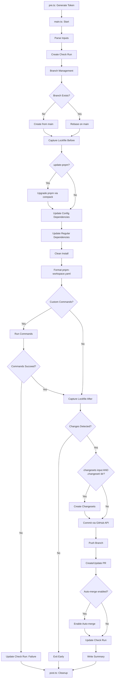

# Architecture

[Back to index](./_index.md)

## Module Structure

```text
src/
├── main.ts              # Main orchestration logic
├── pre.ts               # GitHub App token generation (runs first)
├── post.ts              # Cleanup and token revocation (runs last)
├── lib/
│   ├── inputs.ts        # Action input parsing and validation
│   ├── github/
│   │   ├── auth.ts      # GitHub App authentication
│   │   ├── branch.ts    # Branch management (create, rebase, switch)
│   │   ├── check.ts     # Check run creation and updates
│   │   ├── pr.ts        # Pull request creation and updates
│   │   └── commit.ts    # Commit creation with DCO signoff
│   ├── pnpm/
│   │   ├── config.ts    # Config dependency updates
│   │   ├── regular.ts   # Regular dependency updates (npm query + package.json)
│   │   ├── install.ts   # pnpm install execution
│   │   ├── format.ts    # pnpm-workspace.yaml formatting
│   │   └── upgrade.ts   # pnpm self-upgrade via corepack
│   ├── changeset/
│   │   ├── detect.ts    # Detect if repo uses changesets
│   │   ├── analyze.ts   # Analyze which packages changed
│   │   └── create.ts    # Create changeset files
│   ├── git/
│   │   ├── status.ts    # Git status checking
│   │   └── diff.ts      # Git diff analysis
│   ├── errors/
│   │   └── types.ts     # Typed error definitions
│   └── utils/
│       ├── logging.ts   # Structured logging
│       └── summary.ts   # GitHub Actions summary writing
└── types/
    └── index.ts         # Shared type definitions
```

## Data Flow



## Phase Execution Model

The action executes in **14 distinct steps** (implemented in `src/main.ts`):

### Step 1: Setup

- Parse and validate inputs (including optional `run` commands, `update-pnpm` flag, and `changesets` flag)
- Retrieve GitHub App token from state (generated by `pre.ts`)
- Create check run for status visibility

### Step 2: Branch Management

- Check if update branch exists
- Create new branch from main OR rebase existing branch onto main
- Switch to update branch

### Step 3: Capture Lockfile State (Before)

- Read current `pnpm-lock.yaml` using `@pnpm/lockfile.fs`
- Store snapshot for later comparison
- Log package and importer counts

### Step 4: Upgrade pnpm (conditional)

- Conditional on `inputs.updatePnpm` (default: `true`)
- Read root `package.json` to extract `packageManager` and `devEngines.packageManager` fields
- Parse pnpm version strings (handles `pnpm@10.28.2`, `pnpm@^10.28.2+sha512...`, `^10.28.2`)
- Query available pnpm versions via `npm view pnpm versions --json`
- Filter to stable releases only (no pre-release)
- Resolve latest version within `^` semver range using `semver.maxSatisfying`
- Take the highest resolved version across both fields
- If already up-to-date, skip (return null)
- Run `corepack use pnpm@<version>` to update the `packageManager` field
- Re-read `package.json`, detect indentation, update `devEngines.packageManager.version`
- Report result as a config dependency update (`dependency: "pnpm"`, `type: "config"`)

### Step 5: Update Config Dependencies

- Update config dependencies one by one via `pnpm add --config`
- Track version changes (from/to)
- Accumulate errors without failing entirely

### Step 6: Update Regular Dependencies

- Query npm registry directly for latest versions (avoids `pnpm up --latest` which
  promotes deps to catalogs when `catalogMode: strict` is enabled)
- Find all workspace `package.json` files via `workspace-tools` `getPackageInfosAsync()`
- Match dependency names against glob patterns like `effect`, `@effect/*`, `@savvy-web/*`
- Skip `catalog:` and `workspace:` specifiers (leave catalog-managed deps untouched)
- Query `npm view <pkg> dist-tags.latest --json` for each unique matching dependency
- Compare current version with latest; if newer, construct new specifier preserving
  prefix (`^`, `~`, or exact) and update `package.json` files directly
- Preserve `package.json` indentation (tabs/spaces) via `detectIndent`
- Returns `DependencyUpdateResult[]` directly (no lockfile inference needed)

### Step 7: Clean Install

- Triggered when config updates, regular dependency updates, or pnpm upgrade produced changes
- Remove `node_modules` and `pnpm-lock.yaml` for a fresh lockfile
- Execute `pnpm install` to regenerate lockfile from scratch
- Ensures a fully coherent lockfile after all dependency updates

### Step 8: Format pnpm-workspace.yaml

- Format workspace YAML to match `@savvy-web/lint-staged` PnpmWorkspace handler
- Sort arrays alphabetically (packages, onlyBuiltDependencies, publicHoistPattern)
- Sort `configDependencies` object keys alphabetically
- Sort top-level keys alphabetically (packages first)
- Use consistent YAML stringify options (indent: 2, lineWidth: 0, singleQuote: false)

### Step 9: Run Custom Commands (if specified)

- Execute commands from `run` input sequentially
- All commands run even if some fail (errors collected)
- If ANY command fails, update check run with failure and exit early
- No PR created if commands fail
- Examples: `pnpm lint:fix`, `pnpm test`, `pnpm build`

### Step 10: Capture Lockfile State (After)

- Read updated `pnpm-lock.yaml`
- Store snapshot for comparison

### Step 11: Detect Changes

- Compare lockfile snapshots (before vs after) for catalog and specifier changes
- Regular dependency updates come directly from step 6 (not inferred from lockfile diff)
- Combine pnpm upgrade result, config updates, and regular updates into `allUpdates`
- Check git status for modified files
- Exit early if no changes detected

### Step 12: Create Changesets (conditional)

- **Skipped entirely** if the `changesets` input is `false` (default: `true`)
- When enabled, detect if `.changeset/` directory exists (skip if not present)
- Group changes by affected package
- Create patch changeset for each affected package
- Create empty changeset for root workspace if only config deps changed
- Config dependencies passed to changeset creation

### Step 13: Commit and Push

- **Commit via GitHub API** (not `git commit`)
- Create tree with modified files
- Create commit with sign-off (NO author specified for verification)
- Update branch ref to new commit SHA
- Push to update branch (force-push if rebased)

### Step 14: Create/Update PR

- Check if PR already exists for branch
- Create new PR or update existing PR body
- Generate detailed summary with dependency tables (pnpm upgrade appears in Config Dependencies table)
- If `inputs.autoMerge` is set to a merge method ("merge", "squash", or "rebase"), enable auto-merge via GitHub GraphQL API
  - Uses `enablePullRequestAutoMerge` mutation with the PR's node ID
  - Requires repository "Allow auto-merge" setting enabled
  - Requires branch protection with required status checks on target branch
  - If enabling auto-merge fails, log warning but do not fail the action
- Update check run with success/failure
- Write GitHub Actions summary
