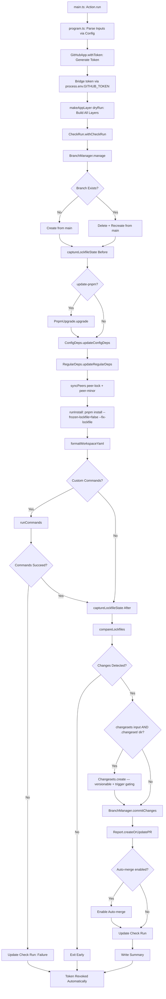

# Architecture

[Back to index](./_index.md)

## Module Structure

```text
src/
├── main.ts                # Module-level entry point — calls `Action.run`
├── main.test.ts
├── main.effect.test.ts
├── program.ts             # Effect program + `runCommands` + `runInstall` helpers
├── errors/
│   ├── errors.ts          # Schema.TaggedError definitions
│   └── errors.test.ts
├── schemas/
│   ├── domain.ts          # Effect Schema definitions (domain types)
│   └── domain.test.ts
├── layers/
│   └── app.ts             # makeAppLayer(dryRun) - layer composition
├── services/
│   ├── branch.ts          # BranchManager service (Context.Tag)
│   ├── branch.test.ts
│   ├── changeset-config.ts # ChangesetConfig service (mode + versionPrivate)
│   ├── changeset-config.test.ts
│   ├── changesets.ts      # Changesets service (versionable + trigger gating)
│   ├── changesets.test.ts
│   ├── config-deps.ts     # ConfigDeps service
│   ├── config-deps.test.ts
│   ├── lockfile.ts        # Lockfile service + helpers
│   ├── lockfile.test.ts
│   ├── peer-sync.ts       # PeerSync standalone helpers (no Tag)
│   ├── peer-sync.test.ts
│   ├── pnpm-upgrade.ts    # PnpmUpgrade service
│   ├── pnpm-upgrade.test.ts
│   ├── publishability.ts  # PublishabilityDetector Layer overrides (silk + adaptive)
│   ├── publishability.test.ts
│   ├── regular-deps.ts    # RegularDeps service
│   ├── regular-deps.test.ts
│   ├── report.ts          # Report service (PR, summary, commit msg)
│   ├── report.test.ts
│   ├── workspace-yaml.ts  # WorkspaceYaml helpers
│   └── workspace-yaml.test.ts
└── utils/
    ├── deps.ts            # parseConfigEntry, matchesPattern, parseSpecifier
    ├── fixtures.test.ts   # Shared test fixtures
    ├── input.ts           # parseMultiValueInput
    ├── input.test.ts
    ├── markdown.ts        # npmUrl, cleanVersion
    ├── pnpm.ts            # parsePnpmVersion, formatPnpmVersion, detectIndent
    └── semver.ts          # resolveLatestInRange
```

**Key architectural notes:**

- **Entry split:** `main.ts` is a thin module-level wrapper that calls
  `Action.run(program, { layer: AppLayer })` where
  `AppLayer = GitHubAppLive.pipe(Layer.provide(OctokitAuthAppLive))`. The
  testable Effect program lives in `program.ts` so tests can import it
  without triggering module-level execution.
- **Effect-first services:** All domain logic is wrapped in Effect services with
  `Context.Tag` + `Layer`. Services are defined in `src/services/`, pure helpers
  in `src/utils/`. Two services (`PeerSync`, `WorkspaceYaml`) export standalone
  helpers without their own Tag.
- **Layer composition:** `src/layers/app.ts` exports `makeAppLayer(dryRun)`
  which wires all library layers (from `@savvy-web/github-action-effects`),
  upstream `WorkspaceDiscoveryLive` + `WorkspaceRootLive` from
  `workspaces-effect` (provided by `NodeContext.layer` from
  `@effect/platform-node`), the `PublishabilityDetector` override, and domain
  service layers together. Token plumbing lives upstream in `program.ts` —
  `GitHubApp.withToken()` runs before `makeAppLayer` and bridges the token to
  `GitHubClientLive` via `process.env.GITHUB_TOKEN`. `makeAppLayer` itself does
  not take a token parameter.
- **No barrel re-exports:** Direct imports everywhere. No `index.ts` files.
- **Tests co-located:** Each `.ts` file has a `.test.ts` sibling in the same directory.
- **Removed dependencies:** `workspace-tools` is no longer used. All workspace
  enumeration now goes through `WorkspaceDiscovery` from `workspaces-effect`
  (consumed directly by `RegularDeps`, `PeerSync`, `Lockfile`, and
  `Changesets`). The local `Workspaces` wrapper service was removed (issue
  #38) once `workspaces-effect@0.5.1` exposed
  `WorkspaceDiscovery.listPackages(cwd?)` and
  `WorkspaceDiscovery.importerMap(cwd?)` accepting an optional cwd parameter.

## Data Flow


```mermaid
graph TD
    A[main.ts: Action.run] --> B[program.ts: Parse Inputs via Config]
    B --> C[GitHubApp.withToken: Generate Token]
    C --> C1[Bridge token via process.env.GITHUB_TOKEN]
    C1 --> D[makeAppLayer dryRun: Build All Layers]
    D --> E[CheckRun.withCheckRun]
    E --> F[BranchManager.manage]
    F --> G{Branch Exists?}
    G -->|No| H[Create from main]
    G -->|Yes| I[Delete + Recreate from main]
    H --> J[captureLockfileState Before]
    I --> J
    J --> J2{update-pnpm?}
    J2 -->|Yes| J3[PnpmUpgrade.upgrade]
    J2 -->|No| K
    J3 --> K[ConfigDeps.updateConfigDeps]
    K --> L[RegularDeps.updateRegularDeps]
    L --> L2[syncPeers peer-lock + peer-minor]
    L2 --> M[runInstall: pnpm install --frozen-lockfile=false --fix-lockfile]
    M --> N[formatWorkspaceYaml]
    N --> O{Custom Commands?}
    O -->|Yes| P[runCommands]
    O -->|No| Q[captureLockfileState After]
    P --> R{Commands Succeed?}
    R -->|No| S[Update Check Run: Failure]
    R -->|Yes| Q
    Q --> T[compareLockfiles]
    T --> T2{Changes Detected?}
    T2 -->|No| U[Exit Early]
    T2 -->|Yes| V{changesets input AND .changeset/ dir?}
    V -->|Yes| W[Changesets.create — versionable + trigger gating]
    V -->|No| X[BranchManager.commitChanges]
    W --> X
    X --> Y[Report.createOrUpdatePR]
    Y --> Y2{Auto-merge enabled?}
    Y2 -->|Yes| Y3[Enable Auto-merge]
    Y2 -->|No| Z
    Y3 --> Z[Update Check Run]
    Z --> AA[Write Summary]
    AA --> AB[Token Revoked Automatically]
    S --> AB
    U --> AB
```

## Execution Model

The action executes as a **single phase**. Steps are implemented in
`src/program.ts`; `src/main.ts` only calls `Action.run`. The numbering below
is descriptive — `program.ts` uses its own step labels in log messages.

### Step 1: Parse Inputs

- Declarative input parsing via Effect's `Config.*` API.
- Multi-value inputs (`config-dependencies`, `dependencies`, `peer-lock`,
  `peer-minor`, `run`) are normalized via `parseMultiValueInput` from
  `utils/input.ts` (supports newline, bullet, comma, JSON-array forms; strips
  `# comments`).
- Cross-validation: at least one update type must be active
  (`config-dependencies`, `dependencies`, or `update-pnpm: true`).
- `peer-lock` and `peer-minor` must not overlap (validated in `program.ts`
  before `syncPeers` is called).
- A warning is emitted for any `peer-lock`/`peer-minor` entry that does not
  match the `dependencies` patterns.
- Inputs: `app-id`, `app-private-key`, `branch`, `config-dependencies`,
  `dependencies`, `peer-lock`, `peer-minor`, `run`, `update-pnpm`,
  `changesets`, `auto-merge`, `dry-run`, `log-level`, `timeout`.

### Step 2: Generate Token and Wire Layers

- `GitHubApp.withToken()` handles the full token lifecycle.
- Inside the callback, the action sets `process.env.GITHUB_TOKEN` so
  `GitHubClientLive` (which reads from the env) picks up the installation
  token, then builds the per-run layer:

```typescript
const appLayer = makeAppLayer(dryRun);
```

`makeAppLayer(dryRun)` (note: `dryRun` is the only parameter — token plumbing
happens upstream) wires:

- Library layers: `GitHubClientLive`, `GitBranchLive`, `GitCommitLive`,
  `CheckRunLive`, `PullRequestLive`, `NpmRegistryLive`, `GitHubGraphQLLive`,
  `CommandRunnerLive`, `DryRunLive(dryRun)`.
- Workspace layers from `workspaces-effect`: `WorkspaceDiscoveryLive`,
  `WorkspaceRootLive` (both provided with `NodeContext.layer` from
  `@effect/platform-node` for FileSystem/Path).
- `workspaces-effect` overrides: `PublishabilityDetectorAdaptiveLive` (which
  consults `ChangesetConfig.mode` per call and dispatches to silk / vanilla /
  noop detection).
- Domain layers: `ChangesetConfig`, `BranchManagerLive`, `PnpmUpgradeLive`,
  `ConfigDepsLive`, `RegularDepsLive`, `ChangesetsLive`, `ReportLive`.

### Step 3: Create Check Run

- `CheckRun.withCheckRun()` creates a check run for status visibility.
- Automatically finalized (success/failure) via resource management.
- Name is `Dependency Updates (Dry Run)` when `dry-run: true`.

### Step 4: Branch Management

- `BranchManager.manage()` handles branch lifecycle.
- If not exists: create new branch from default branch.
- If exists: delete and recreate from default branch (fresh start).
- Fetch and checkout the branch via `CommandRunner`.

### Step 5: Capture Lockfile State (Before)

- `captureLockfileState()` reads current `pnpm-lock.yaml` using
  `@pnpm/lockfile.fs`. Standalone function exported alongside the
  `Lockfile` service Tag for direct use by `program.ts`.

### Step 6: Upgrade pnpm (conditional)

- Conditional on `inputs["update-pnpm"]` (default: `true`).
- `PnpmUpgrade.upgrade()` parses version, queries npm, runs `corepack use`.
- Updates `devEngines.packageManager.version` if present.

### Step 7: Update Config Dependencies

- `ConfigDeps.updateConfigDeps()` queries npm via `NpmRegistry` service.
- Edits `pnpm-workspace.yaml` in place (avoids `pnpm add --config` catalog promotion).
- Tracks version changes (from/to).

### Step 8: Update Regular Dependencies

- `RegularDeps.updateRegularDeps()` queries npm via `NpmRegistry` service.
- Enumerates workspace `package.json` files via `WorkspaceDiscovery` from
  `workspaces-effect` (consumed directly — there is no longer a local
  `Workspaces` wrapper service).
- Matches patterns and updates specifiers.
- Skips `catalog:` and `workspace:` specifiers.
- Iterates `dependencies`, `devDependencies`, and `optionalDependencies`
  (see `DEP_SECTIONS` in `regular-deps.ts`); `peerDependencies` are
  intentionally excluded — peer ranges are managed by `syncPeers`.
- Each match emits one `DependencyUpdateResult` per (path, dep, section)
  with the precise `type` field (`dependency` / `devDependency` /
  `optionalDependency`) so a dep declared in multiple sections of the
  same package gets one record per section.

### Step 8b: Sync Peer Dependencies

- `syncPeers(config, devUpdates, workspaceRoot?)` from `src/services/peer-sync.ts`.
- For each devDep update matching `peer-lock` or `peer-minor` input:
  - `peer-lock`: Sync peer range on every version bump.
  - `peer-minor`: Sync peer range only on minor+ bumps (floor patch to .0).
- Uses `semver-effect` (`SemVer.parse`) for version parsing.
- Produces `DependencyUpdateResult[]` records of type `peerDependency` that
  flow into `allUpdates` for reporting and into `Changesets.create` as
  changeset triggers.

### Step 9: Reconcile Lockfile and Install

- Triggered when any of `configUpdatesFromPnpm`, `configUpdates`,
  `regularUpdates`, or `peerUpdates` is non-empty.
- Implemented as `runInstall()` in `program.ts`:
  `pnpm install --frozen-lockfile=false --fix-lockfile`.
  - `--frozen-lockfile=false` opts out of the CI default that refuses to write
    lockfile changes.
  - `--fix-lockfile` reconciles the lockfile against the just-modified
    manifests while leaving unrelated transitives at their currently-pinned
    versions. This replaces the older `rm -rf node_modules pnpm-lock.yaml &&
    pnpm install` clean-install approach.

### Step 10: Format pnpm-workspace.yaml

- `formatWorkspaceYaml()` from `services/workspace-yaml.ts` sorts arrays,
  keys, and configDependencies. Stringify options: `indent: 2`, `lineWidth:
  0`, `singleQuote: false`.

### Step 11: Run Custom Commands (if specified)

- Execute commands from `run` input sequentially via `runCommands` in
  `program.ts`, which shells out through `CommandRunner` (`sh -c …`).
- All commands run even if some fail (errors collected).
- If ANY command fails, finalize the check run with `failure` and exit early.

### Step 12: Capture Lockfile State (After)

- `captureLockfileState()` reads updated `pnpm-lock.yaml`.

### Step 13: Detect Changes

- `compareLockfiles(before, after, workspaceRoot?)` produces `LockfileChange[]`.
  Catalog comparison now emits **one record per (catalog change, consuming
  importer, dep section) triple** with the precise type field
  (`dependency` / `devDependency` / `optionalDependency` / `peerDependency`)
  so downstream Changesets gating can use `type` alone as the trigger signal.
- `allUpdates` is the concatenation of `configUpdatesFromPnpm`,
  `configUpdates`, `regularUpdates`, and `peerUpdates`.
- Also checks `git status --porcelain` to detect any other modified files.
- Exit early if no changes detected.

### Step 14: Create Changesets (conditional)

- Skipped if `changesets` input is `false` (default: `true`).
- `Changesets.create(workspaceRoot, lockfileChanges, regularUpdates,
  peerUpdates)` has `workspaceRoot` as the **first** parameter.
  `regularUpdates` (renamed from `devUpdates`) now carries
  dependency/devDependency/optionalDependency updates from the multi-section
  RegularDeps scan.
- Gating rules:
  - Skips entirely if no `.changeset/` directory exists.
  - For each workspace package, builds per-package `triggerRows` and
    `devRows`. `dependency`, `optionalDependency`, and `peerDependency`
    lockfile changes are **triggers**; `devDependency` lockfile changes
    are informational only.
  - Peer-sync updates are always triggers. `regularUpdates` are routed
    by `update.type`: `dependency`/`optionalDependency`/`peerDependency`
    go to triggers, `devDependency` goes to informational rows only. The
    routing uses the same `TRIGGER_TYPES` set as lockfile changes so a
    `peerDependency` arriving via either path is treated identically.
  - A package gets a changeset only when it has at least one trigger row
    AND it is **versionable** (publishable per `PublishabilityDetector`, OR
    `versionPrivate` per `ChangesetConfig`).
  - Empty changesets are no longer written (the previous fallback path that
    wrote a generic patch on every run has been removed).

### Step 15: Commit, Push, and Create PR

- `BranchManager.commitChanges()` commits via GitHub API (verified/signed).
- `Report.createOrUpdatePR()` creates/updates PR with detailed summary.
- Enables auto-merge if configured.
- Updates check run with `success`.
- Writes GitHub Actions summary via `ActionOutputs`.
