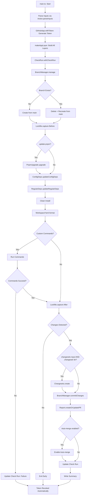

# Architecture

[Back to index](./_index.md)

## Module Structure

```text
src/
├── main.ts              # Single-phase entry point (orchestrator)
├── main.test.ts
├── main.effect.test.ts
├── errors/
│   ├── errors.ts        # Schema.TaggedError definitions
│   └── errors.test.ts
├── schemas/
│   ├── domain.ts        # Effect Schema definitions (domain types)
│   └── domain.test.ts
├── layers/
│   └── app.ts           # makeAppLayer(token, dryRun) - layer composition
├── services/
│   ├── branch.ts        # BranchManager service (Context.Tag)
│   ├── branch.test.ts
│   ├── changesets.ts     # Changesets service + helpers
│   ├── changesets.test.ts
│   ├── config-deps.ts   # ConfigDeps service
│   ├── config-deps.test.ts
│   ├── lockfile.ts      # Lockfile service + helpers
│   ├── lockfile.test.ts
│   ├── pnpm-upgrade.ts  # PnpmUpgrade service
│   ├── pnpm-upgrade.test.ts
│   ├── regular-deps.ts  # RegularDeps service
│   ├── regular-deps.test.ts
│   ├── report.ts        # Report service (PR, summary, commit msg)
│   ├── report.test.ts
│   ├── workspace-yaml.ts # WorkspaceYaml service + helpers
│   └── workspace-yaml.test.ts
└── utils/
    ├── deps.ts          # parseConfigEntry, matchesPattern, parseSpecifier
    ├── fixtures.test.ts # Shared test fixtures
    ├── markdown.ts      # npmUrl, cleanVersion
    ├── pnpm.ts          # parsePnpmVersion, formatPnpmVersion, detectIndent
    └── semver.ts        # resolveLatestInRange
```

**Key architectural notes:**

- **Effect-first services:** All domain logic is wrapped in Effect services with
  `Context.Tag` + `Layer`. Services are defined in `src/services/`, pure helpers
  in `src/utils/`.
- **Layer composition:** `src/layers/app.ts` exports `makeAppLayer(token, dryRun)`
  which wires all library layers (from `@savvy-web/github-action-effects`) and
  domain service layers together.
- **No barrel re-exports:** Direct imports everywhere. No `index.ts` files.
- **Tests co-located:** Each `.ts` file has a `.test.ts` sibling in the same directory.
- **Deleted directories:** `src/lib/` (entire directory) and `src/types/` have been removed.

## Data Flow


```mermaid
graph TD
    A[main.ts: Start] --> B[Parse Inputs via Action.parseInputs]
    B --> C[GitHubApp.withToken: Generate Token]
    C --> D[makeAppLayer: Build All Layers]
    D --> E[CheckRun.withCheckRun]
    E --> F[BranchManager.manage]
    F --> G{Branch Exists?}
    G -->|No| H[Create from main]
    G -->|Yes| I[Delete + Recreate from main]
    H --> J[Lockfile.capture Before]
    I --> J
    J --> J2{update-pnpm?}
    J2 -->|Yes| J3[PnpmUpgrade.upgrade]
    J2 -->|No| K
    J3 --> K[ConfigDeps.updateConfigDeps]
    K --> L[RegularDeps.updateRegularDeps]
    L --> M[Clean Install]
    M --> N[WorkspaceYaml.format]
    N --> O{Custom Commands?}
    O -->|Yes| P[Run Commands]
    O -->|No| Q[Lockfile.capture After]
    P --> R{Commands Succeed?}
    R -->|No| S[Update Check Run: Failure]
    R -->|Yes| Q
    Q --> T{Changes Detected?}
    T -->|No| U[Exit Early]
    T -->|Yes| V{changesets input AND\n.changeset/ dir?}
    V -->|Yes| W[Changesets.create]
    V -->|No| X[BranchManager.commitChanges]
    W --> X
    X --> Y[Report.createOrUpdatePR]
    Y --> Y2{Auto-merge enabled?}
    Y2 -->|Yes| Y3[Enable Auto-merge]
    Y2 -->|No| Z
    Y3 --> Z[Update Check Run]
    Z --> AA[Write Summary]
    AA --> AB[Token Revoked Automatically]
    S --> AB
    U --> AB
```

## Execution Model

The action executes as a **single phase** with **16 steps** (implemented in `src/main.ts`):

### Step 1: Parse Inputs

- Declarative input parsing via `Action.parseInputs()` with Effect Schema
- Cross-validates that at least one update type is active
- Inputs: `app-id`, `app-private-key`, `branch`, `config-dependencies`, `dependencies`,
  `run`, `update-pnpm`, `changesets`, `auto-merge`, `dry-run`

### Step 2: Generate Token

- `GitHubApp.withToken()` handles the full token lifecycle
- Generates GitHub App installation token from app-id and private key
- Token is automatically revoked when the callback completes (or on failure)

### Step 3: Build App Layer

- `makeAppLayer(token, dryRun)` from `src/layers/app.ts` wires all layers:
  - Library layers: `GitHubClientLive`, `GitBranchLive`, `GitCommitLive`,
    `CheckRunLive`, `PullRequestLive`, `NpmRegistryLive`, `GitHubGraphQLLive`,
    `CommandRunnerLive`, `DryRunLive`
  - Domain layers: `BranchManagerLive`, `PnpmUpgradeLive`, `ConfigDepsLive`,
    `RegularDepsLive`, `ReportLive`

### Step 4: Create Check Run

- `CheckRun.withCheckRun()` creates a check run for status visibility
- Automatically finalized (success/failure) via resource management

### Step 5: Branch Management

- `BranchManager.manage()` handles branch lifecycle
- If not exists: create new branch from default branch
- If exists: delete and recreate from default branch (fresh start)
- Fetch and checkout the branch via `CommandRunner`

### Step 6: Capture Lockfile State (Before)

- `Lockfile.capture()` reads current `pnpm-lock.yaml` using `@pnpm/lockfile.fs`
- Store snapshot for later comparison

### Step 7: Upgrade pnpm (conditional)

- Conditional on `inputs["update-pnpm"]` (default: `true`)
- `PnpmUpgrade.upgrade()` parses version, queries npm, runs `corepack use`
- Updates `devEngines.packageManager.version` if present

### Step 8: Update Config Dependencies

- `ConfigDeps.updateConfigDeps()` queries npm via `NpmRegistry` service
- Edits `pnpm-workspace.yaml` in place (avoids `pnpm add --config` catalog promotion)
- Track version changes (from/to)

### Step 9: Update Regular Dependencies

- `RegularDeps.updateRegularDeps()` queries npm via `NpmRegistry` service
- Finds workspace `package.json` files, matches patterns, updates specifiers
- Skips `catalog:` and `workspace:` specifiers

### Step 10: Clean Install

- Triggered when any updates produced changes
- Remove `node_modules` and `pnpm-lock.yaml` via `CommandRunner`
- Execute `pnpm install` to regenerate lockfile from scratch

### Step 11: Format pnpm-workspace.yaml

- `WorkspaceYaml.format()` sorts arrays, keys, and configDependencies
- Consistent YAML stringify options (indent: 2, lineWidth: 0, singleQuote: false)

### Step 12: Run Custom Commands (if specified)

- Execute commands from `run` input sequentially via `CommandRunner`
- All commands run even if some fail (errors collected)
- If ANY command fails, update check run with failure and exit early

### Step 13: Capture Lockfile State (After)

- `Lockfile.capture()` reads updated `pnpm-lock.yaml`
- Store snapshot for comparison

### Step 14: Detect Changes

- `Lockfile.compare()` compares snapshots (before vs after)
- Combine pnpm upgrade, config updates, and regular updates into `allUpdates`
- Check git status for modified files via `CommandRunner`
- Exit early if no changes detected

### Step 15: Create Changesets (conditional)

- Skipped if `changesets` input is `false` (default: `true`)
- `Changesets.create()` detects `.changeset/` directory and creates patch changesets

### Step 16: Commit, Push, and Create PR

- `BranchManager.commitChanges()` commits via GitHub API (verified/signed)
- `Report.createOrUpdatePR()` creates/updates PR with detailed summary
- Enable auto-merge if configured
- Update check run with success
- Write GitHub Actions summary via `ActionOutputs`
