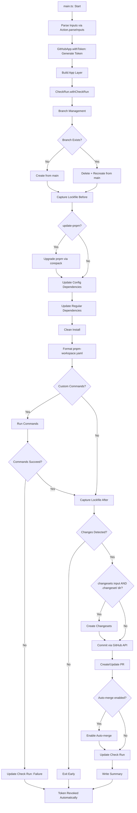

# Architecture

[Back to index](./_index.md)

## Module Structure

```text
src/
├── main.ts              # Single-phase entry point (uses Action.run + GitHubApp.withToken)
├── lib/
│   ├── __test__/
│   │   └── fixtures.ts  # Shared test fixtures
│   ├── errors/
│   │   └── types.ts     # Re-exports schema error types
│   ├── schemas/
│   │   ├── index.ts     # Effect Schema definitions (domain types)
│   │   └── errors.ts    # Typed error definitions (Schema.TaggedError)
│   ├── github/
│   │   └── branch.ts    # Branch management + commit via GitHub API
│   ├── pnpm/
│   │   ├── config.ts    # Config dependency updates (direct YAML editing)
│   │   ├── regular.ts   # Regular dependency updates (npm query + package.json)
│   │   ├── format.ts    # pnpm-workspace.yaml formatting
│   │   └── upgrade.ts   # pnpm self-upgrade via corepack
│   ├── changeset/
│   │   └── create.ts    # Create changeset files
│   └── lockfile/
│       └── compare.ts   # Lockfile state capture and comparison
└── types/
    └── index.ts         # Re-exports from schemas (BranchResult, DependencyUpdateResult, etc.)
```

**Key architectural notes:**

- **Single-phase design:** There is only one entry point (`main.ts`). The pre/post
  phases (`pre.ts`, `post.ts`) and auth module (`github/auth.ts`) have been deleted.
  Token lifecycle is handled by `GitHubApp.withToken()` from the library.
- **No custom services:** The `src/lib/services/index.ts` module has been deleted.
  All services come from `@savvy-web/github-action-effects` (v0.4.0): `CommandRunner`,
  `GitBranch`, `GitCommit`, `CheckRun`, `GitHubClient`, `AutoMerge`.
- **No custom input parsing:** The `src/lib/inputs.ts` module has been deleted.
  Input parsing uses `Action.parseInputs()` declaratively in `main.ts`.
- **All GitHub Action plumbing** (inputs, outputs, logging) is provided by
  `@savvy-web/github-action-effects`. The `@actions/core` package is not imported
  directly. The only direct `@actions/github` import is for `context.sha`.

## Data Flow


```mermaid
graph TD
    A[main.ts: Start] --> B[Parse Inputs via Action.parseInputs]
    B --> C[GitHubApp.withToken: Generate Token]
    C --> D[Build App Layer]
    D --> E[CheckRun.withCheckRun]
    E --> F[Branch Management]
    F --> G{Branch Exists?}
    G -->|No| H[Create from main]
    G -->|Yes| I[Delete + Recreate from main]
    H --> J[Capture Lockfile Before]
    I --> J
    J --> J2{update-pnpm?}
    J2 -->|Yes| J3[Upgrade pnpm via corepack]
    J2 -->|No| K
    J3 --> K[Update Config Dependencies]
    K --> L[Update Regular Dependencies]
    L --> M[Clean Install]
    M --> N[Format pnpm-workspace.yaml]
    N --> O{Custom Commands?}
    O -->|Yes| P[Run Commands]
    O -->|No| Q[Capture Lockfile After]
    P --> R{Commands Succeed?}
    R -->|No| S[Update Check Run: Failure]
    R -->|Yes| Q
    Q --> T{Changes Detected?}
    T -->|No| U[Exit Early]
    T -->|Yes| V{changesets input AND\n.changeset/ dir?}
    V -->|Yes| W[Create Changesets]
    V -->|No| X[Commit via GitHub API]
    W --> X
    X --> Y[Create/Update PR]
    Y --> Y2{Auto-merge enabled?}
    Y2 -->|Yes| Y3[Enable Auto-merge]
    Y2 -->|No| Z
    Y3 --> Z[Update Check Run]
    Z --> AA[Write Summary]
    AA --> AB[Token Revoked Automatically]
    S --> AB
    U --> AB
```

## Execution Model

The action executes as a **single phase** with **16 steps** (implemented in `src/main.ts`):

### Step 1: Parse Inputs

- Declarative input parsing via `Action.parseInputs()` with Effect Schema
- Cross-validates that at least one update type is active
- Inputs: `app-id`, `app-private-key`, `branch`, `config-dependencies`, `dependencies`,
  `run`, `update-pnpm`, `changesets`, `auto-merge`, `dry-run`

### Step 2: Generate Token

- `GitHubApp.withToken()` handles the full token lifecycle
- Generates GitHub App installation token from app-id and private key
- Token is automatically revoked when the callback completes (or on failure)

### Step 3: Build App Layer

- Constructs all dependent service layers from the token:
  `GitHubClientLive`, `GitBranchLive`, `GitCommitLive`, `CheckRunLive`,
  `GitHubGraphQLLive`, `CommandRunnerLive`, `DryRunLive`

### Step 4: Create Check Run

- `CheckRun.withCheckRun()` creates a check run for status visibility
- Automatically finalized (success/failure) via resource management

### Step 5: Branch Management

- Check if update branch exists via `GitBranch` service
- If not: create new branch from default branch
- If exists: delete and recreate from default branch (fresh start)
- Fetch and checkout the branch via `CommandRunner`

### Step 6: Capture Lockfile State (Before)

- Read current `pnpm-lock.yaml` using `@pnpm/lockfile.fs`
- Store snapshot for later comparison

### Step 7: Upgrade pnpm (conditional)

- Conditional on `inputs["update-pnpm"]` (default: `true`)
- Parse pnpm version from `packageManager` and `devEngines.packageManager` fields
- Query available pnpm versions via `npm view pnpm versions --json` (uses `CommandRunner`)
- Resolve latest version within `^` semver range
- Run `corepack use pnpm@<version>` via `CommandRunner`
- Update `devEngines.packageManager.version` if present

### Step 8: Update Config Dependencies

- Query npm directly for latest versions and integrity hashes via `CommandRunner`
- Edit `pnpm-workspace.yaml` in place (avoids `pnpm add --config` catalog promotion)
- Track version changes (from/to)

### Step 9: Update Regular Dependencies

- Query npm registry directly for latest versions via `CommandRunner`
- Find all workspace `package.json` files via `workspace-tools`
- Match dependency names against glob patterns
- Skip `catalog:` and `workspace:` specifiers
- Update `package.json` files directly, preserving indentation

### Step 10: Clean Install

- Triggered when any updates produced changes
- Remove `node_modules` and `pnpm-lock.yaml` via `CommandRunner`
- Execute `pnpm install` to regenerate lockfile from scratch

### Step 11: Format pnpm-workspace.yaml

- Sort arrays alphabetically, sort `configDependencies` keys, sort top-level keys
- Consistent YAML stringify options (indent: 2, lineWidth: 0, singleQuote: false)

### Step 12: Run Custom Commands (if specified)

- Execute commands from `run` input sequentially via `CommandRunner`
- All commands run even if some fail (errors collected)
- If ANY command fails, update check run with failure and exit early

### Step 13: Capture Lockfile State (After)

- Read updated `pnpm-lock.yaml`
- Store snapshot for comparison

### Step 14: Detect Changes

- Compare lockfile snapshots (before vs after)
- Combine pnpm upgrade, config updates, and regular updates into `allUpdates`
- Check git status for modified files via `CommandRunner`
- Exit early if no changes detected

### Step 15: Create Changesets (conditional)

- Skipped if `changesets` input is `false` (default: `true`)
- Detect if `.changeset/` directory exists
- Create patch changeset for each affected package

### Step 16: Commit, Push, and Create PR

- Commit via GitHub API (verified/signed commits via `GitCommit` service)
- Create/update PR with detailed summary via `GitHubClient`
- Enable auto-merge if configured (via `AutoMerge.enable()`)
- Update check run with success
- Write GitHub Actions summary via `ActionOutputs`
