# Architecture

[Back to index](./_index.md)

## Module Structure

```text
src/
├── pre.ts                 # Pre-phase entry — GitHubToken.provision + start time
├── main.ts                # Main-phase entry — Action.run(program)
├── post.ts                # Post-phase entry — duration report + GitHubToken.dispose
├── program.ts             # PURE COMPOSITION: read inputs → run steps → fold outputs → report
├── format.ts              # the run's rendering surface (run-context/result blocks, tallies)
├── state.ts               # StartTimeState (Schema.Class) + STATE_KEYS cross-phase state
├── errors/
│   └── errors.ts          # Schema.TaggedErrorClass definitions (4 live classes; see 03)
├── schema/
│   ├── domain.ts          # Effect Schema definitions + RunResultDocument (`result` output)
│   ├── inputs.ts          # INPUT_NAMES tuple + readInputs + InnerProgramInputs
│   └── outputs.ts         # OUTPUT_NAMES tuple + initialOutputs + emitOutputs
├── steps/                 # one module per orchestration unit; each declares its own
│   ├── detect-package-manager.ts   #   result type, an explicit requirement channel, and
│   ├── branch.ts                   #   a tagged error ONLY if it can actually fail
│   ├── lockfile-snapshot.ts        #   (four carry `never`)
│   ├── upgrade-package-manager.ts
│   ├── upgrade-runtimes.ts
│   ├── config-dependencies.ts      #   owns the pnpm/bun/npm dispatch
│   ├── regular-dependencies.ts
│   ├── peer-sync.ts
│   ├── install.ts                  #   runInstall lives here
│   ├── format-workspace.ts
│   ├── custom-commands.ts          #   runCommands; returns failures, does NOT conclude
│   ├── detect-changes.ts           #   git status; the only I/O that was left in program.ts
│   ├── changesets.ts
│   └── commit-and-pr.ts            #   one module: the PR must describe a commit that exists
├── layers/
│   └── app.ts             # makeAppLayer(dryRun, { runtimeLive }) - layer composition
├── services/
│   ├── branch.ts          # BranchManager service
│   ├── catalog-config-deps.ts   # CatalogConfigDeps service (bun config-dep workflow)
│   ├── changesets.ts      # Changesets service (thin adapter over silk DepsRegen)
│   ├── config-deps.ts     # ConfigDeps service (pnpm-workspace.yaml)
│   ├── lockfile.ts        # Lockfile service + standalone capture/compare helpers
│   ├── module-catalogs.ts # fetchModuleCatalogs (tarball → catalogs export)
│   ├── package-manager.ts # detectPackageManager + SupportedPm / DetectedPm
│   ├── package-manager-upgrade.ts  # PackageManagerUpgrade service (pnpm/bun/npm)
│   ├── peer-sync.ts       # syncPeers standalone helpers (no service tag)
│   ├── regular-deps.ts    # RegularDeps service
│   ├── release-age.ts     # ReleaseAge service + gate-discovery helpers
│   ├── report.ts          # Report service (PR, summary, commit msg)
│   ├── runtime-upgrade.ts # RuntimeUpgrade service (devEngines.runtime upgrades)
│   └── workspace-yaml.ts  # WorkspaceYaml helpers
└── utils/
    ├── branch.ts          # resolveTargetBranch
    ├── catalogs.ts        # CatalogMap, normalize/read/write/threeWayMergeCatalogs
    ├── commit-subject.ts  # buildUpdateSubject (PR title / commit subject)
    ├── deps.ts            # parseConfigEntry, matchesPattern, parseSpecifier
    ├── markdown.ts        # bold, rule (the 2 builders the kit lacks), npmUrl, cleanVersion
    ├── pnpm.ts            # parsePnpmVersion, formatPnpmVersion, detectIndent, corepackHashFromIntegrity
    ├── runtime.ts         # isStaticVersion, findRuntimeEntry
    └── semver.ts          # resolveLatestSatisfying, configDepUpgradeRange, …

__test__/
├── unit/                  # mirrors src/ — every unit suite lives here, not beside the source
│   ├── program.inner.test.ts    # THE log-stream contract suite (see @./08-testing.md)
│   ├── format.test.ts           # shape of the decision record; wording owned by the above
│   ├── generate-schema.test.ts  # JSON Schema drift guard
│   ├── doubles.test.ts          # self-tests for the shared doubles
│   ├── schema/…  steps/…  services/…  utils/…  errors/…
├── integration/           # real-IO suites (workspaces, lockfile compare, changesets, runtimes)
└── utils/                 # RESERVED helper modules — excluded from collection (see 08-testing)
    ├── action-doubles.ts  # in-memory ActionState / GitHubApp / ActionOutputs doubles
    └── fixtures.ts        # shared domain fixtures
```

**Key architectural notes:**

- **Three-phase entry:** the action runs as `pre` / `main` / `post`. `pre.ts`
  provisions the GitHub App installation token; `main.ts` is a thin wrapper
  that calls `Action.run(program)`; `post.ts` reports total duration and revokes
  the token. The testable Effect program lives in `program.ts` so tests can
  import it without triggering module-level execution — and every entry point
  carries the same `process.env.GITHUB_ACTIONS` guard, so importing one never
  runs it. The build
  (`@savvy-web/github-action-builder`) takes the three entry points from
  `action.config.ts`.
- **Effect v4 / `@effected` kit:** the action runs on Effect v4 and the
  `@effected/*` first-party kit. The former all-in-one
  `@savvy-web/github-action-effects` is deleted; see the split table in
  @./01-dependencies.md. `action.yml` inputs and outputs were unchanged by that
  migration — the one behavioral input change is `upgrade-package-manager`,
  whose default flipped from `"true"` to `"false"` (opt-in, matching the
  `upgrade-runtime-*` inputs).
- **Package-manager dispatch:** `detectPackageManager()` resolves the workspace
  root and package manager **once**, inside the check run, and every later
  dispatch point reads that one value: config dependencies (pnpm → `ConfigDeps`,
  bun → `CatalogConfigDeps`, npm → skip with a warning), install
  (`runInstall(pm, root)`), the package-manager upgrade, and the pnpm-only
  workspace-YAML formatting step. Yarn is rejected with `InvalidInputError`.
- **Effect-first services:** all domain logic is wrapped in Effect services with
  `Context.Service` + `Layer` in `src/services/`, pure helpers in `src/utils/`.
  `PeerSync`, `WorkspaceYaml` (helpers), `package-manager.ts` and
  `module-catalogs.ts` export standalone functions rather than their own tag.
- **Layer composition:** `src/layers/app.ts` exports
  `makeAppLayer(dryRun, { runtimeLive })`, wiring the kit layers, the root-bound
  `@effected/workspaces` layers, silk's `Changesets.DepsRegenDefault`, the
  `@effected/runtimes` resolver layers, and the domain layers. The `GitHubClient`
  is built from `GitHubToken.clientLayer()`, which reads the token envelope the
  pre phase persisted to `ActionState` — there is no `process.env.GITHUB_TOKEN`
  bridge. `ActionState` itself is **not** rebuilt here: it comes from
  `Action.run`'s runtime.
- **No barrel re-exports:** direct imports everywhere. No `index.ts` files.
- **Tests are not co-located:** every unit suite lives under `__test__/unit/`
  mirroring `src/`. Sources have no `.test.ts` siblings.
- **Workspace enumeration:** all direct workspace enumeration goes through
  `WorkspaceDiscovery` from `@effected/workspaces` (arg-less `listPackages()` /
  `importerMap()`; the root is bound when the layer is built), consumed by
  `RegularDeps`, `PeerSync` and `Lockfile`. `Changesets` does not enumerate
  directly — that happens inside silk's `DepsRegen`.

## Data Flow

```mermaid
graph TD
    PRE[pre.ts: GitHubToken.provision + save start time] --> A
    A[main.ts: Action.run] --> B[program.ts: readInputs via ActionInput]
    B --> D[makeAppLayer dryRun runtimeLive: Build All Layers, GitHubToken.clientLayer]
    D --> E[CheckRun.withCheckRun]
    E --> PM[detectPackageManager: root + pm, yarn rejected]
    PM --> EV[BranchManager.validateBranches source/target: fail fast if missing]
    EV --> F[BranchManager.manage: GitBranch.upsert from source-branch]
    F --> J[captureLockfileState Before]
    J --> J2{upgrade-package-manager?}
    J2 -->|Yes| J3[PackageManagerUpgrade.upgrade mode, pm, root]
    J2 -->|No| J4
    J3 --> J4{upgrade-runtime-*?}
    J4 -->|Yes| J5[RuntimeUpgrade.upgrade]
    J4 -->|No| K
    J5 --> K{config-dependencies + which pm?}
    K -->|pnpm| K1[ConfigDeps.updateConfigDeps: pnpm-workspace.yaml]
    K -->|bun| K2[CatalogConfigDeps.update: package.json catalogs merge]
    K -->|npm| K3[SKIPPED: no catalog: protocol]
    K1 --> L[RegularDeps.updateRegularDeps]
    K2 --> L
    K3 --> L
    L --> L2[syncPeers peer-lock + peer-minor]
    L2 --> M[runInstall pm, root]
    M --> N{pnpm?}
    N -->|Yes| N1[formatWorkspaceYaml]
    N -->|No| O
    N1 --> O{Custom Commands?}
    O -->|Yes| P[runCommands]
    O -->|No| Q[captureLockfileState After]
    P --> R{Commands Succeed?}
    R -->|No| S[conclude failure + fail]
    R -->|Yes| Q
    Q --> T[compareLockfiles + git status --porcelain]
    T --> T2{Changes Detected?}
    T2 -->|No| U[conclude neutral + exit early]
    T2 -->|Yes| V{changesets input AND .changeset/ dir?}
    V -->|Yes| VB[BranchManager.ensureBaseHistory target]
    VB --> W[Changesets.create root, target — silk DepsRegen plan+execute]
    V -->|No| X[BranchManager.commitChanges]
    W --> X
    X --> Y[Report.createOrUpdatePR: PullRequest.upsert + setAutoMerge]
    Y --> Z[conclude success]
    Z --> AA[Write Summary + outputs]
    AA --> POST[post.ts: report duration + GitHubToken.dispose]
    S --> POST
    U --> POST
```



Phases run as separate Node processes. `pre` provisions the installation
token and persists its envelope to `ActionState` (backed by `GITHUB_STATE`);
`main` reads it back via `GitHubToken.clientLayer()`; `post` always runs (even if
`main` fails) to revoke the token via `GitHubToken.dispose()`.

## Execution Model

The action runs as **three phases** (`pre` / `main` / `post`), each a separate
Node process. `pre.ts` provisions the installation token (`GitHubToken.provision`
with a fail-fast scope check) and records the start time to `ActionState`;
`post.ts` reports total duration and revokes the token (`GitHubToken.dispose`,
guarded so it never fails the workflow). The dependency-update workflow below
runs entirely in the `main` phase. `src/program.ts` **composes** it — it reads
inputs, runs the steps in order, folds their results into outputs and reports —
while each step's body lives in its own module under `src/steps/`. `program.ts`
performs no I/O and builds no strings of its own; a step doing either is the
signal it belongs in `steps/` or `format.ts`.

**Steps are named, not numbered.** Once the package-manager, config-dependency
and install steps each dispatch on the detected package manager there is no
fixed sequence, and `innerProgram` logs a named step line per stage. The
numbering below is descriptive only. A step that does not run **always logs
that it did not, and why** — `changesets: false`, "no `.changeset/` directory"
and "nothing to install" must never look like silence. Decisions (which path a
dispatch took and on what evidence; a resolution's input range, resolved value,
current value and verdict) log at info; per-item evidence (registry queries,
per-file writes) stays at debug, so the info stream reads end to end as a
decision log.

### Step 1: Read Inputs (`readInputs`)

- Every input is read through **`ActionInput`**, never bare `Config` — see the
  `ActionInput` note in @./01-dependencies.md for why a bare `Config` read
  resolves nothing under the runner. `readInputs` is exported and tested
  directly against a runner-shaped (`INPUT_*`) environment.
- Multi-value inputs (`config-dependencies`, `dependencies`, `peer-lock`,
  `peer-minor`, `run`) use `ActionInput.list(...)` — which owns the bullet /
  comment / JSON-array / comma grammar formerly implemented locally in
  `src/utils/input.ts` (deleted). `list` **fails** on an absent or empty input,
  so the `Config.withDefault([])` on each read is load-bearing.
- Cross-validation: at least one update type must be active
  (`config-dependencies`, `dependencies`, `upgrade-package-manager` non-`false`,
  or any `upgrade-runtime-*` non-`false`). Because
  `upgrade-package-manager` now defaults to `"false"`, a workflow that sets
  **nothing** fails this check rather than silently doing a package-manager-only
  run.
- `peer-lock` and `peer-minor` must not overlap; a warning is emitted for any
  peer entry that matches no `dependencies` pattern.
- The `main` phase does **not** parse `app-client-id` / `app-private-key` —
  those are consumed by `GitHubToken.provision` in `pre.ts`.
- `source-branch` (default `main`) is the ref the update branch is cut from and
  reset to. `target-branch` (default `""`) is the PR merge target; an empty
  value follows `source-branch`, resolved by `resolveTargetBranch`.
- `upgrade-runtime-*` (`false` | `auto` | range) and `upgrade-package-manager`
  (`false` | `true` | `auto` | range) are validated with the standalone
  `Range.parse` from `@effected/semver` when the value is not one of the
  keywords; failures raise `InvalidInputError`. An unknown `runtime-data` value
  warns and falls back to `offline`.

### Step 2: Wire Layers

`program.ts` does no token plumbing — it reads `headSha` from
`ActionEnvironment`, resolves the log level from `env.isDebug`, and builds:

```typescript
const appLayer = makeAppLayer(dryRun, { runtimeLive });
```

`makeAppLayer(dryRun, { runtimeLive })` wires:

- `GitHubToken.clientLayer()` (`Layer.orDie`) for the `GitHubClient`, plus
  `Repo.layerFromConfig()`, and the `@effected/github` resource layers built over
  them: `GitBranch.layer`, `GitCommit.layer`, `CheckRun.layer`,
  `PullRequest.layer`.
- `NpmRegistry.layer` over `FetchHttpClient.layer`, `NodeServices.layer` (the
  `ChildProcessSpawner` `Run` needs, plus FileSystem/Path) and
  `DryRun.layerFrom(dryRun)`.
- Workspace layers from `@effected/workspaces`: `WorkspaceRoot.layer`,
  `WorkspaceDiscovery.layer()`, `PackageManagerDetector.layer` and
  `LockfileReader.layer()` (all root-bound at build).
- `Changesets.DepsRegenDefault` from `@savvy-web/silk-effects` over the platform
  layer.
- Domain layers: `BranchManagerLive`, `PackageManagerUpgradeLive`,
  `ConfigDepsLive`, `CatalogConfigDepsLive`, `RegularDepsLive`, `ChangesetsLive`,
  `ReportLive`, `RuntimeUpgradeLive`.
- `ReleaseAgeLive()` over `NodeServices.layer` + `NpmRegistry`, provided to
  `ConfigDepsLive` and `RegularDepsLive`.
- Runtime resolver layers: `*Resolver.layerOffline` (default) or `*Resolver.layer`
  (live), selected by `runtimeLive`.

### Step 3: Create Check Run

- `CheckRun.withCheckRun(name, headSha, (id, conclude) => …)` — the callback
  receives a `conclude` function and the check run is concluded on **every** exit
  path. Name is `Dependency Updates (Dry Run)` when `dry-run: true`.

### Step 4: Detect the Package Manager

- `detectPackageManager()` runs **inside** the check run so an unsupported
  workspace (yarn, or no workspace root at all) fails with a visible check run
  rather than an invisible early exit.
- Its `DetectedPm` (`{ pm, version, root }`) is the value every later dispatch
  reads. `describePmEvidence` best-effort re-derives which signal the detector
  most likely used, for the "Run context" log block only — it is explicitly not a
  source of truth.
- Every subsequent step reads and writes at `detected.root`, not `process.cwd()`:
  the action can legitimately be invoked from a subdirectory of the workspace.

### Step 5: Branch Management

- `BranchManager.validateBranches(sourceBranch, targetBranch)` runs **first**,
  failing fast with `InvalidInputError` if either ref is missing (the target
  check is skipped when `target === source`).
- `BranchManager.manage(branch, sourceBranch)` reads the source SHA and calls
  `GitBranch.upsert`, which creates the branch when absent and force-resets it to
  that SHA when present, reporting which happened. This replaced the old
  exists/delete/create sequence, which had the same net effect but raced against
  anything reading the ref in between.

### Step 6: Capture Lockfile State (Before)

- `captureLockfileState(pm, root)` reads the detected manager's lockfile
  (`LOCKFILE_NAMES`) and parses it with `@effected/lockfiles`' pure
  `Lockfile.parse(content, { format })`. A missing lockfile is a logged skip, not
  a failure.

### Step 7: Upgrade the Package Manager (conditional)

- Conditional on `upgrade-package-manager !== "false"` (default `"false"`).
- `PackageManagerUpgrade.upgrade(mode, pm, root)` applies to the **detected**
  manager. It always resolves to a `PackageManagerUpgradeOutcome` — never `null`
  — so the caller can report *why* nothing happened: `disabled`, `no reference`,
  `unsatisfiable`, `already current`, `error`.
- The `unsatisfiable` outcome is the acceptance signal and the only one reported
  at **warning** level: nothing in the manager's release list satisfies the
  range, overwhelmingly because the range was typed for a *different* manager
  (a pnpm `^11.0.0` copy-pasted into a bun repo). It must not scroll past at the
  same level as a benign skip.
- Write format: corepack-managed managers (pnpm, npm) get a pinned
  `version+sha512.<hex>` in both `packageManager` and
  `devEngines.packageManager.version`; bun gets a bare version and the integrity
  fetch is skipped entirely.
- A successful upgrade **does** open the install gate; the subsequent install
  performs the corepack switch.

### Step 8: Upgrade Runtimes (conditional)

- `RuntimeUpgrade.upgrade(config, root)` reads root `package.json`, resolves via
  `@effected/runtimes` (offline snapshot or live per `runtime-data`) and rewrites
  `devEngines.runtime` in place, preserving the object/array shape.
- **Upgrade only, never add** (all modes): a runtime with no existing entry is
  skipped with a warning naming the runtime and the input.
- **Always writes an exact version** (all modes): the range only selects which
  line to resolve; an existing `^24.0.0` is rewritten as e.g. `24.9.1`, because
  `silk-runtime-action` downstream does not support range operators.
- `auto` is a no-op on a static pin or an already-current value. EOL major lines
  return `VersionNotFoundError` and are skipped per-runtime with a warning.
- Runtime bumps flow into `allUpdates` for PR/commit/summary but never create a
  changeset and never trigger the install.

### Step 9: Update Config Dependencies (dispatches on package manager)

- **pnpm** — `ConfigDeps.updateConfigDeps(deps, root)` edits `pnpm-workspace.yaml`
  in place (avoiding `pnpm add --config` catalog promotion). Config deps carry no
  declared range, so a conservative one is synthesized from the current major via
  `configDepUpgradeRange`, candidates are filtered through
  `ReleaseAge.filterVersions`, and the highest in-range version is resolved with
  `resolveLatestSatisfying` — never npm's absolute `latest`.
- **bun** — `CatalogConfigDeps.update(deps, root)` reproduces the workflow: it
  fetches the config dependency's published tarball, reads its `catalogs` export
  (`fetchModuleCatalogs`) and three-way merges it into the manifest's top-level
  `catalog` / `catalogs` fields, using the **lockfile's** installed version as the
  merge base so a user override is distinguishable from an entry the action wrote
  last run. Emits `CatalogDelta` records (added/updated/removed/kept per catalog)
  alongside the updates. Names owned by this path are excluded from the
  regular-deps pass so the same manifest entry is not bumped twice.
- **npm** — skipped with a warning: npm implements no `catalog:` protocol.

### Step 10: Update Regular Dependencies

- `RegularDeps.updateRegularDeps(patterns, root, exclude?)` queries every
  published version via `NpmRegistry.versions`, filters through
  `ReleaseAge.filterVersions`, and resolves the highest version **satisfying the
  current specifier treated as a range**, re-applying the operator verbatim. So
  `^4.0.0` stays within major 4, `~3.0.0` within the minor, `>=4.0.0` may cross a
  major, and an exact pin never bumps. Caret-on-zero (`^0.y.z`) is the one
  exception, widened via `resolutionRangeForSpecifier` to `>=version <2.0.0`.
- The `exclude` set is populated only under bun (the config-dep names
  `CatalogConfigDeps` already owns).
- Enumerates workspace manifests via `WorkspaceDiscovery`; skips `catalog:` and
  `workspace:` specifiers; iterates `dependencies`, `devDependencies` and
  `optionalDependencies` (`peerDependencies` are managed by `syncPeers`), emitting
  one result per (path, dep, section) with the precise `type`.

### Step 11: Sync Peer Dependencies

- `syncPeers(config, regularUpdates, root)` — `peer-lock` syncs the peer range on
  every version bump, `peer-minor` only on minor+ bumps (flooring patch to `.0`).
  Produces `peerDependency`-typed results that flow into reporting only; the
  changeset step derives its own content from git.

### Step 12: Regenerate Lockfile and Install

- Gated on any of the package-manager, config, regular or peer updates being
  non-empty; otherwise logged as "nothing to install".
- `runInstall(pm, root)` **regenerates** rather than repairs, because the action
  mutates all three inputs to resolution (manager version, manager config,
  declared ranges) and a repair-only install never re-runs resolution:
  - **pnpm:** `pnpm clean --lockfile` then `pnpm install --frozen-lockfile=false`.
    `clean --lockfile` unlinks the lockfile and `node_modules` via Node (safe
    across platforms, including Windows junctions), requires pnpm 11+, and runs a
    consumer's own `clean`/`purge` script over the built-in when one exists.
  - **bun:** `bun install --force` (re-resolves against the registry rather than
    replaying the lockfile).
  - **npm:** remove `package-lock.json` via `node:fs` (not `rm` — it does not
    exist on a Windows runner) then `npm install`.
- Advancing transitive versions is the expected consequence, not noise.

### Step 13: Format `pnpm-workspace.yaml` (pnpm only)

- `formatWorkspaceYaml(root)` sorts arrays, keys and configDependencies. Skipped
  with a logged reason under bun/npm, which have no such file.

### Step 14: Run Custom Commands (if specified)

- `runCommands` executes each `run` entry sequentially via `Run.collect` on
  `sh -c …`. A non-zero exit is a **result**, not an error channel failure, so the
  failure branch is driven by the exit code; the catch covers only a genuine spawn
  failure. All commands are attempted, errors collected.
- If any command failed, the check run is concluded `failure`, outputs are set to
  no-changes, and the program fails.

### Step 15: Capture Lockfile State (After) and Detect Changes

- `compareLockfiles(before, after, root)` produces `LockfileChange[]` (one record
  per catalog change × consuming importer × dep section, each carrying the precise
  type).
- `git -c core.fileMode=false status --porcelain` supplies the file-level signal.
  `core.fileMode=false` is deliberate: executable-bit-only flips (e.g. husky
  chmod-ing hooks during a `run` command) do not survive the content-based GitHub
  API commit, so counting them would produce an empty commit and a spurious PR.
  `BranchManager.commitChanges` queries status the same way.
- `allUpdates` is the concatenation of the package-manager, runtime, config,
  regular and peer updates. No changes → conclude `neutral` and exit early.

### Step 16: Create Changesets (conditional)

- Skipped (with a logged reason) when `changesets: false` or no `.changeset/`
  directory exists.
- `BranchManager.ensureBaseHistory(targetBranch)` runs first so the
  `merge-base(target) → worktree` diff resolves on a shallow checkout.
- `Changesets.create(root, targetBranch)` delegates to silk's `DepsRegen`
  (`plan` → `execute`), which owns the diff, the consolidation and the
  versionable-minus-ignored gating. The per-run update records are **not** inputs
  to this step.

### Step 17: Commit, Push, and Create PR

- `BranchManager.commitChanges()` commits via the GitHub API (verified/signed),
  modelling deletions as `FileDeletion` and content as `FileContent`, then syncs
  the working tree with `git fetch` + `git reset --hard`.
- `Report.createOrUpdatePR()` calls `PullRequest.upsert` against the resolved
  `target-branch`, then `setAutoMerge` as a separate call whose failure degrades
  to a warning (the repository may simply not have auto-merge enabled). A PR
  failure is caught in `innerProgram` and degrades to a warning plus a `FAILED`
  step line.
- The check run is concluded `success`, outputs are set, and the job summary is
  written via `ActionOutputs.summary`.
